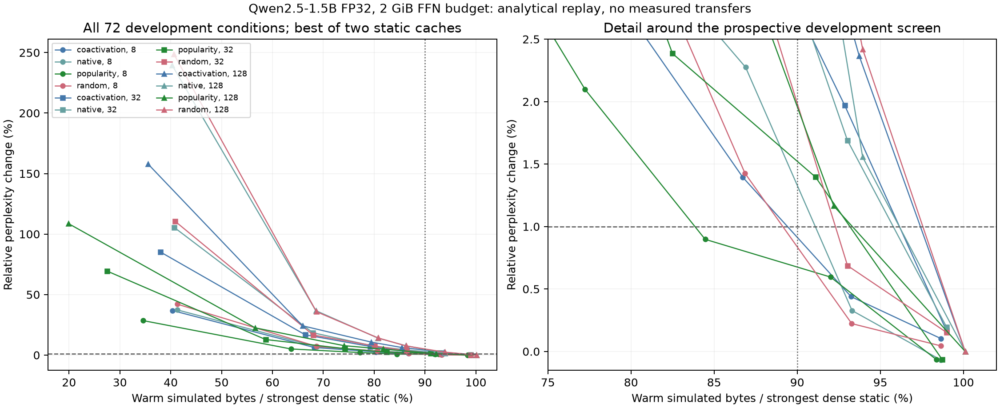

# Applied-mask traces and bounded-cache simulation

One of 72 selection conditions passes the prospective development screen:
**popularity packing, 8 neurons per group, 90% group retention**. Relative perplexity
is **1.008978**, KL is **0.015765**, and top-1 agreement is **94.31%**. Both static
policies pass at all four cache budgets, producing eight passing warm rows. These
are eight traffic evaluations of one quality condition, not eight independent
quality successes. No other layout/width/retention combination passes.

At 2 GiB, the equal-layer static cache gives the lowest passing warm traffic:
**15.54% less than the strongest dense static baseline**. This condition is nominated
for the next causal-predictor protocol by the predeclared ordering. The result is
teacher-forced development evidence on reused Wikipedia articles. Nine of the 16
articles individually exceed 1% PPL increase; the document range is 0.985415–1.028098.
The aggregate screen does not establish per-document, task, or held-out equivalence.

## What completed

The protocol and apparatus were pushed as `e607865` before new measurements. The
Qwen2.5-1.5B-Instruct checkpoint, FP32 / torch 2.10.0+cu130 environment, 80 calibration
articles, 16 development articles, token IDs, and regenerated layouts match the
previous pilot. All 112 local reconstruction and 64 full-layout checks pass; maximum
relative logit L2 is 2.174e-6. All 256 overlapping per-document quality rows reproduce
the previous width-32/128, 50%/75% pilot rows exactly.

The expanded grid covers four layouts, widths 8/32/128, and retention fractions
50/75/85/90/95/99%. It preserves 1,152 document traces and quality rows before
aggregation. Each mask describes all 256 input positions and 28 FFNs; quality uses
255 next-token predictions per article. Replay publishes 36,864 document/cache/state
rows and 2,304 aggregate rows across four policies, four budgets, and cold/warm states.

## Cache result and its limits

For the nominated condition at 2 GiB, mean simulated GiB per input token is:

| Policy | Cold | Warm | Warm saving versus strongest dense static |
|---|---:|---:|---:|
| Dense static baseline | 2.314666 | 2.306854 | — |
| No retained cache | 3.875977 | 3.875977 | -68.02% |
| LRU | 3.875977 | 3.875977 | -68.02% |
| Global static hot set | 2.019359 | 2.011548 | 12.80% |
| Equal-layer static hot set | 1.956200 | 1.948388 | 15.54% |

The FFN has 4.306641 GiB of FP32 groupable weights. The 2 GiB width-8 cache retains
14,562 slots, reserves one 144 KiB incoming slot inside the budget, and leaves 80 KiB
unallocated. Static cold preload costs 2,147,254,272 bytes per article, including
unused hot pages. Fixed non-FFN parameters add 1,550,637,056 bytes; KV, workspaces,
host staging, and other allocations are outside this simulation's memory accounting.
The actual diagnostic still keeps the complete model resident and executes dense
gate/up and masked dense down projections.

LRU has zero hits throughout this grid. Even at 50% retention and 2 GiB, consecutive
visits to a layer encounter at least 15,120 / 3,780 / 945 distinct other-layer groups
for widths 8/32/128, exceeding retained capacities 14,562 / 3,639 / 909. The validated
sufficient bound therefore applies to all tested traces, including warm wraparound.
This is exact for the declared request order and slot policy, not an optimal-cache
claim. Independent review checked 28,672 synthetic cases against explicit LRU replay.

At the nominated condition, selected groups cover 91.14% of the top individual-neuron
selections. Fetching *every* group covering those top neurons would amplify their
individual weight volume by 1.111110, almost fetching the whole FFN. That cover mask
was not separately quality-evaluated; its geometric amplification is not the measured
quality or simulated fetched volume of the applied mask.

At width 128, 99% retention rounds up to all 70 groups. Such rows omit nothing, and a
larger transfer granularity can still lose slightly to the strongest width-8 dense
baseline because of reserved-slot overhead. Preserve these rows as boundary controls.

## Reproduction and next gate

The [archive](../results/cache-trace-20260911/archive.json) indexes exact run, replay,
figure, source, and input receipts. The 290,741,226-byte `cache-traces-v0.4.0.zip`
release asset contains all 1,152 packed traces; its SHA256 is
`37e53063c55b6f7e7e6b2896c52ddbdee190b50c3bd5a9699df2e11022c8c614`.
See the archive README for lossless decompression and replay instructions. The
original apparatus report retains preexisting boilerplate saying no cache simulation
is implemented; the separately archived `analysis` directory supplies this study's
cache simulation and supersedes that sentence. No original receipt was rewritten.

The 53-test pre-measurement suite and the current 59-test suite pass. Review corrected
the strongest-baseline comparison across widths, missing numerical-gate validation,
and fully resident baselines with zero traffic. Figure v2 changes only the detail
axis and archives its own plotting source; model measurements and replay are unchanged.

Issue #9 is complete. A causal selector must now approach the nominated hindsight
condition using information available before its current FFN work, with charged cost
and independent omission audits. Multi-domain held-out quality, actual bounded
RAM-to-VRAM execution, and corrective refinement remain open. Reconstructed token-major
prefill traces do not establish incremental-decode or closed-loop behavior.
