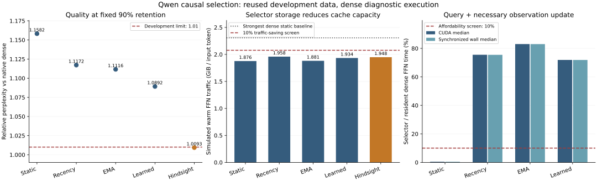

# Causal selection misses the frozen development screen

**None of the four causal selectors passes all three prospective development screens.** The prescribed decision leaves physical paging and corrective refinement gated. The result covers these initial implementations at this operating point; broader predictor feasibility remains open.

The prospective [protocol](causal-control-protocol.md) and apparatus were pushed as
`85efbc7` before pretrained fitting or evaluation. The condition is the unchanged
v0.4 nomination: Qwen2.5-1.5B-Instruct, popularity packing, width 8, 90% retention,
and a 2 GiB equal-layer static cache. The 80 calibration and 16 development articles
are reused Wikipedia data. This is a fixed-point development study, not a new
held-out benchmark or a complete retention sweep.

## Frozen feasibility decision

The three screens are aggregate relative PPL <=1.01, warm simulated byte reduction
>=10%, and both selector CUDA/wall timing medians <=10% of the corresponding
resident dense-FFN medians. Hindsight is a noncausal control and cannot qualify.
Every result is preserved regardless of those screens.

| Selector | Relative PPL | KL | Top-1 (%) | Selector MiB | Warm saving (%) | CUDA cost (%) | Wall cost (%) | Screen |
|---|---:|---:|---:|---:|---:|---:|---:|---|
| static | 1.158203 | 0.175924 | 81.373 | 0.1495 | 18.663 | 0.450 | 0.456 | fail |
| recency | 1.117159 | 0.149310 | 83.137 | 1.1963 | 15.103 | 75.521 | 75.476 | fail |
| ema | 1.111589 | 0.154815 | 83.162 | 1.1963 | 18.449 | 83.026 | 83.002 | fail |
| learned | 1.089204 | 0.121448 | 85.686 | 26.0791 | 16.171 | 71.893 | 71.876 | fail |
| hindsight | 1.009318 | 0.015948 | 94.289 | 0.0000 | 15.539 | n/a | n/a | control |

Warm traffic is FFN-cache traffic under the fixed static policy, with persistent
selector tensors subtracted from its 2 GiB allocation and one incoming group reserved.
The dense comparison receives the whole 2 GiB and may choose any parent grid layout
and width. Cold rows charge static FFN preload. Predictor tensors are already
initialized for replay; this does not measure their first-load traffic or startup
latency. KV, audit buffers, allocator workspaces and fixed weights are not bounded
by this FFN-cache simulation. No actual RAM-to-VRAM transfers were measured.

Timing covers causal query and necessary selected-observation update on the first
32 calibration-token fixtures across all 28 resident FFNs, with three warm and ten
measured repetitions. Each selector has its own paired dense measurement. CUDA
events include the submitted workload interval; synchronized wall time also charges
host work. Static and learned selectors do not construct unused observation payloads.
These are eager PyTorch implementations; the comparison is not end-to-end paged
latency, and it does not evaluate fused or graph-captured selector implementations.

The 16 independent article replays charge one preload per cold article:

| Selector | Warm GiB / input token | Cold GiB / input token | Static FFN preload GiB / article |
|---|---:|---:|---:|
| static | 1.876328 | 1.884139 | 1.999649 |
| recency | 1.958459 | 1.966267 | 1.998688 |
| ema | 1.881256 | 1.889063 | 1.998688 |
| learned | 1.933811 | 1.941524 | 1.974380 |
| hindsight | 1.948386 | 1.956197 | 1.999786 |

The strongest dense warm comparison uses 2.306854 GiB per input token. Selected
group volume, misses and cold preload are retained separately in every raw row.

## Feature availability and fitting

All causal masks are chosen from the current normalized FFN input and previously
selected observations, before current gate/up computation. Static uses calibration
popularity. Recency replaces observed scores and resets omitted groups to the prior;
EMA updates selected scores with weight 0.1 and leaves omitted state unchanged.
The learned selector uses a fixed Gaussian 64-column input projection and its
absolute values, per-layer standardization and ridge 0.01 with an intercept.
FP64 calibration statistics and the CPU FP64 solution are preserved; inference
tensors are FP32. Calibration uses dense document prefill, while evaluation uses
each approximate path's current incremental input. This changes the feature
distribution; no development refit or hyperparameter search was performed.

## Per-document quality and independent audits

| Selector | Articles above 1% PPL increase | Minimum relative PPL | Maximum relative PPL | Mean local omitted-output L2 | p95 local L2 | Fraction local L2 >0.1 | Mean retained importance | Mean hindsight overlap |
|---|---:|---:|---:|---:|---:|---:|---:|---:|
| static | 16/16 | 1.089298 | 1.256893 | 0.160395 | 0.252360 | 0.869228 | 0.937129 | 0.922073 |
| recency | 16/16 | 1.029979 | 1.318553 | 0.176631 | 0.260815 | 0.921151 | 0.930140 | 0.914470 |
| ema | 16/16 | 1.042666 | 1.203480 | 0.162090 | 0.251815 | 0.872846 | 0.936331 | 0.921218 |
| learned | 16/16 | 1.027518 | 1.214186 | 0.157777 | 0.244297 | 0.874294 | 0.937351 | 0.922410 |
| hindsight | 10/16 | 0.983419 | 1.028421 | 0.079612 | 0.111961 | 0.216108 | 0.963426 | 1.000000 |

Omitted-output L2 is a local geometric audit on each path's own current FFN input;
0.1 is descriptive, not a task-failure label or a validated detector threshold.
At 90% retention, random set overlap is already high. Importance/overlap and cache
misses do not establish safety. Dense omitted-group computations are audit-only and
cannot feed the causal selectors. The model still computes dense projections before
applying the requested mask; this is analytical quality evaluation.

## Fixed topic transition

The first two development token sequences are concatenated without resetting KV or
selector state at the boundary. This is one Wikipedia transition, not a multi-domain
stress test. Post-boundary quality includes prediction of the second article's first
token. Its warm replay represents the carried static hot set; its cold row is an
explicit separate-preload counterfactual.

| Selector | Whole-episode relative PPL | Post-boundary relative PPL | Post-boundary KL |
|---|---:|---:|---:|
| static | 1.125936 | 1.118574 | 0.187746 |
| recency | 1.122397 | 1.172563 | 0.164385 |
| ema | 1.202755 | 1.256669 | 0.288424 |
| learned | 1.074645 | 1.083656 | 0.143481 |
| hindsight | 1.017808 | 1.011723 | 0.017441 |

| Selector | Whole warm GiB | Whole cold GiB | Post-boundary warm GiB | Post-boundary cold GiB |
|---|---:|---:|---:|---:|
| static | 960.679688 | 962.679337 | 480.339844 | 482.339493 |
| recency | 1003.513733 | 1005.512421 | 502.325134 | 504.323822 |
| ema | 963.365433 | 965.364120 | 481.659027 | 483.657715 |
| learned | 992.925522 | 994.899902 | 498.064911 | 500.039291 |
| hindsight | 998.919662 | 1000.919449 | 500.391953 | 502.391739 |

Whole-episode traffic covers 512 input visits; the post-boundary subset covers 256.
The post-boundary cold column charges another preload as a separate counterfactual,
not an additional transfer that actually occurred during the warm transition.

## Complete generated-path inspection ledger

Each path consumes a 32-token plain-text prefix and produces exactly 64 greedy tokens,
including EOS IDs without early termination. Every selector uses its own generated
history. The table reports positional token matching to dense, not accuracy: contexts
already differ after the first divergence. There is no external task score.

| Selector | Document index | First differing generated position (1-based) | Matching generated token IDs (%) |
|---|---:|---:|---:|
| static | 1 | 1 | 3.125 |
| static | 2 | 11 | 15.625 |
| static | 3 | 4 | 15.625 |
| static | 4 | 2 | 7.812 |
| recency | 1 | 22 | 32.812 |
| recency | 2 | 11 | 15.625 |
| recency | 3 | 4 | 14.062 |
| recency | 4 | 2 | 6.250 |
| ema | 1 | 13 | 18.750 |
| ema | 2 | 11 | 17.188 |
| ema | 3 | 4 | 12.500 |
| ema | 4 | 6 | 9.375 |
| learned | 1 | 1 | 0.000 |
| learned | 2 | 6 | 10.938 |
| learned | 3 | 11 | 15.625 |
| learned | 4 | 2 | 7.812 |
| hindsight | 1 | 51 | 98.438 |
| hindsight | 2 | 7 | 18.750 |
| hindsight | 3 | 13 | 18.750 |
| hindsight | 4 | 7 | 9.375 |

All 20 candidate sequences, four dense sequences, decoded text and generated-path
masks/audits are retained. The decoder uses the pinned pretrained implementation;
this is not an assistant-chat evaluation.

## Provenance and validation

The original numerical limits remain 0.01 relative L2 and 0.001 KL. All 28 local and
17 incremental layout checks passed before calibration fitting or selection. Maximum
local relative L2 is 1.50012e-6; maximum incremental layout relative L2 is 1.14874e-6
and KL is 4.51807e-8. Fresh dense prefill/incremental drift is recorded separately on
all 16 articles: maximum relative L2 4.69315e-6 and KL 5.21800e-8.
The model runs FP32 under Python 3.14.3 / torch 2.10.0+cu130 / Transformers 5.13.1,
SDPA and disabled TF32 on the RTX 5080 Laptop GPU. The pinned parent file hashes,
checkpoint catalog, exact token IDs, source and protocol are archived.

The diagnostic retains 6,174,857,216 bytes of model parameters
and another 4,624,220,160 bytes of FFN restoration copies.
Those are tensor payloads, not allocator peaks. Success is published only after
restoration succeeds. No bounded process-memory claim follows from this apparatus.

Ninety CPU tests and three reviews preceded pretrained measurement; the final focused
review rejected 42 additional corruption probes. The independent analyzer checks
every numerical gate and ordered condition, dense-reference-derived NLL, checkpoint
provenance, actual masks and charged cache replay, timing medians, generated receipts,
all five aggregates and the frozen nomination. All 307 raw rows are preserved. The
integrated suite passes 111 tests in both the baseline and separate torch 2.12
environments. Restoring all 124 payloads from the three release ZIPs and rerunning
the analyzer reproduces the validated summary exactly. No final-test scoring or
retuning was performed.

The earlier v0.4 hindsight result used prefill masking and reached relative PPL
1.008978 with 9/16 articles above the individual 1% line. This run uses actual
incremental KV execution and a fresh reference: hindsight reaches 1.009318 with
10/16 above that line. Both receipts remain intact; the later value does not replace
the earlier measurement.

Evidence: [archive and restoration](../results/causal-control-20260911),
[release](releases/v0.7.0.md). This completes bounded experiment #15; the broader
predictor goal #10 and held-out quality #8 remain open. Physical execution #11 and
corrective refinement #12 retain their separate gates.
