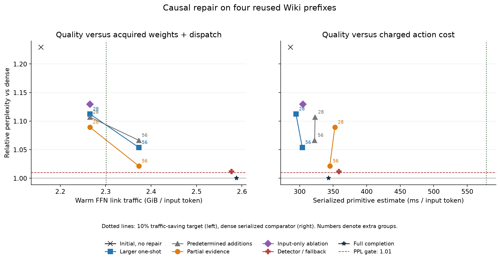

# Causal evidence and complete acquisition costs

Partial execution evidence lowers the aggregate Wiki perplexity increase at matched
92.5% retention to **8.95%**, versus **11.25%** for a larger one-shot
decision and **10.71%** for predetermined additions. It remains worse than
a matched control on two of four prefixes, and all four exceed the 1% quality limit.
This is a mixed quality ablation, not a qualifying repair controller.

| Policy, 28 extra groups | Relative PPL | Individual passes | Warm saving | Serialized ms/input |
|---|---:|---:|---:|---:|
| Larger one-shot | 1.112546 | 0/4 | 11.404% | 294.536 |
| Predetermined repair | 1.107101 | 0/4 | 11.404% | 323.003 |
| Partial-evidence repair | 1.089487 | 0/4 | 11.404% | 352.509 |

The current-input-only one-shot ablation has relative PPL
**1.129547**. Adding the explicit history
features improves the one-shot aggregate in this fixture, but neither version
passes quality. This does not establish a broadly effective persistent estimator.

The dense serialized comparator is **578.222 ms/input**.
These costs sum measured synthetic resident and dynamically gathered/staged/
transferred/packed FFN primitives, controller processing and output additions.
They are not measured inference latency or exposed transfer stalls.

The primitive medians are non-monotonic with batch size. Full completion itself
estimates **343.086 ms/input** despite retaining
100% of FFN volume. Its initial/corrective split avoids the expensive larger cold
batch used by the declared dense schedule. This means the apparent headroom does
not isolate an omission benefit. The dense comparator is not optimized over batch
partitions; a future runtime proposal must compare against that stronger scheduling
control. The frozen Gate C result is preserved as a conditional plausibility screen.

All ten prospectively declared conditions and all 158 quality/calibration/control
rows are retained. Gate B passes: **full-112**. Gate C passes:
**initial-0, one_shot-28, predetermined-28, partial-28, input_only-28**. **No policy passes both.** Full completion is an
expensive numerical endpoint, not evidence of sparse efficiency. The 24 full-completion
controls pass, including generated-token and aligned-logit checks on all twenty tasks.

At 56 additions, partial repair gives relative PPL
**1.021551** with only **7.192%**
warm saving, below the 10% traffic target. The detector/fallback policy invokes
dense completion on **96.610%** of Wiki layer visits,
with relative PPL **1.011613** and
**-0.802%** warm saving. Every correction setting uses at most
one additional round; its frequency and complete cost remain visible.

The new controller combines current input, observed history, age, a change signal
and protected residency. Partial repair also receives selected-group innovations
and the first output norm. A separate detector decides on bounded dense completion.
Two calibration passes collect labels on approximate/corrected states. During
development, initial and repair masks are recomputed on each policy's own trajectory;
dense omitted scores and audit results cannot enter its queries or state updates.
The diagnostic still computes dense gate/up and keeps full weights and backups.

The 2 GiB FFN allowance now includes 256 MiB acquisition workspace for both paths
and a 32 MiB controller reservation for sparse policies. Equal final cardinality
matches cold bytes across controls. Dispatch IDs, initial and corrective batches,
resident execution, observation/update processing and output sums are charged.
Fifteen exact group counts replace coarse cost interpolation; all thirty primitive
integrity conditions pass. No dynamically preassembled payload is treated as free.
The changed allowance is not interchangeable with v0.7/v0.8 weight-cache accounting.

The reused balanced chat tasks retain **12/20 dense successes**. Candidate success
counts and lost dense successes are:

| Policy | Successes /20 | Lost dense successes |
|---|---:|---:|
| Larger one-shot | 8 | 5 |
| Predetermined repair | 6 | 6 |
| Partial-evidence repair | 9 | 4 |

The v0.11 Gate A still fails its balanced qualification criteria. These task rows
describe regressions and new successes under the unchanged scalar-answer scorer;
they cannot establish preserved qualified agent utility. All eighty dense/candidate
continuations are published. The Wiki prefixes and task prompts are reused development
inputs, not held-out evidence. Code questions do not constitute executable-code tests.

The protocol and execution source were committed and pushed as
[113d4bf](https://github.com/displague/dynamic-model-loading/commit/113d4bf2bef946bb1db4e09c9423b2cccf201723) before
calibration or scoring. Measurements use the pinned Qwen2.5-1.5B-Instruct FP32
checkpoint, Python 3.14.3, PyTorch 2.10.0+cu130 and Transformers 5.13.1, with TF32
disabled. Timing ran separately from model evaluation and CPU review/tests.

The released analyzer includes a separately reviewed correction deriving vocabulary
width from the pinned checkpoint config rather than a wrong hardcoded constant.
The first timing run preserved nine completed fixtures before failing exact-mask
replay on full completion. Contiguous reload changed fitted matrix layout and a
one-ULP score difference swapped two nearly tied groups. The separately committed
timing correction reconstructs the original solve layout and requires bitwise-equal
coefficients, then reruns the complete unchanged timing grid in a fresh directory.
Both timing records and the diagnosis are retained; failed-run timings are not mixed
into the cost result. Neither correction changes quality execution or scoring.
Independent analysis verifies source/input
identities, calibration fits, permitted state, ranking/masks, logits, generations,
traffic, all 520 controller/execution timing rows and 420 batch rows. Restored
release assets reproduce the analysis exactly. The complete CPU suite passes
**199 tests** in both available PyTorch environments (2.10.0+cu130 and 2.12.0+cu130)
on the clean committed implementation. Publication also requires repeating the
complete suite on the final clean release candidate.

This closes bounded [#22](https://github.com/displague/dynamic-model-loading/issues/22). Broader causal acquisition
[#19](https://github.com/displague/dynamic-model-loading/issues/19), dense/held-out quality [#8](https://github.com/displague/dynamic-model-loading/issues/8), physical paging
[#11](https://github.com/displague/dynamic-model-loading/issues/11) and refinement runtime [#16](https://github.com/displague/dynamic-model-loading/issues/16) remain open.
Physical paging stays gated. A new predictor, representation or baseline experiment
needs a fresh prospective protocol; these negative and mixed results are preserved.

[Detailed interpretation](https://github.com/displague/dynamic-model-loading/blob/v0.12.0/docs/causal-evidence-results.md) ·
[Every policy, prefix and cost](https://github.com/displague/dynamic-model-loading/blob/v0.12.0/docs/causal-evidence-tables.md) ·
[All continuations](https://github.com/displague/dynamic-model-loading/blob/v0.12.0/docs/causal-evidence-generations.md) ·
[Frozen protocol](https://github.com/displague/dynamic-model-loading/blob/v0.12.0/docs/causal-evidence-protocol.md) ·
[Archive and restoration](https://github.com/displague/dynamic-model-loading/blob/v0.12.0/results/causal-evidence-20260912/README.md)
## What this experiment changes

Every policy chooses its initial mask on its own current trajectory, before the
current gate/up computation. It protects the common resident hot core, then ranks
cold groups until the initial set contains 1008 of 1120 groups per layer. This is
resident-aware selection; it does not first execute only the resident core before
deciding on all cold work. A repair policy evaluates one additional batch and adds
its contribution before the next layer commits. There is at most one corrective
round, with no charged exploration probes in this particular experiment.

The predictor combines a small projection of current FFN input with observed
history, age and an input-change signal. Partial repair additionally sees selected
group innovations and the first output norm. Separate ridge models rank additional
groups and predict whether initial relative FFN error exceeds 0.05. A dense-completion
fallback acquires all 112 omitted groups when that detector fires. This detector's
local error target is not itself a validated task-failure criterion.

Two fixed calibration passes each use four disjoint training prefixes of 128 tokens.
The second pass visits approximate/corrected states produced by the first fitted
controller. Its examples supply the final fits. Dense labels are collected after
the calibration actions; development-time APIs and state updates receive only
permitted inputs and executed-group observations. The four Wiki development prefixes
and twenty chat tasks are reused development inputs, not held-out evidence.

The input-only ablation, resident core, log-scaled labels, eight-dimensional input
projection and limited calibration distinguish this estimator from v0.7. Differences
between releases do not isolate the effect of temporal history. The matched controls
inside this frozen experiment provide the relevant evidence about partial observation.

## Fully charged action model

The 2 GiB FFN working allowance reserves 256 MiB for acquisition/packing workspace
on both dense and sparse paths. Sparse policies also pay a common 32 MiB controller
reservation and an incoming-group slot. Their resident core contains 12,514 groups
(447 in the first 26 layers and 446 in the last two), costing 1,845,264,384 bytes to
preload. The dense static comparison has no controller reservation. These are new
complete-action budgets; v0.7/v0.8 weight-cache results remain unchanged.

Every group contains eight neurons and 147,456 FP32 weight bytes. All resident groups
execute; equal final cardinality therefore matches cold-weight bytes per visit
across one-shot, predetermined and partial policies. GPU-to-host int64 dispatch IDs
are charged separately. The 28-addition points retain 92.5% of FFN volume and leave
11.4035% simulated warm link saving. The 56-addition points retain 95% and leave
7.1923%, already below the 10% traffic screen. Probe bytes are zero.

The cost fixture first verifies that its 32-input replay reproduces the recorded
masks. It measures controller projection, ranking, selected-score processing,
observed-state updates and index handoff. Separate output-addition timing charges
the sums joining resident/cold and corrective outputs. Dense FFN and down-product
timings are diagnostic; down products are not added again to primitives that already
execute FFNs. Ten measured repetitions follow three warmups.

After unloading the model, the fixture measures resident execution and dynamically
gathered/staged/transferred/packed FFNs at fifteen exact batch sizes. This avoids
interpolating across v0.9's coarse size grid. Dynamic preparation enters the cold
clock on both sides. Buffers and initialized timing events are prepared before the
clock. Serialized sums charge each initial and corrective batch separately; they
do not establish exposed stalls, overlap, end-to-end latency or a physical pager.

The quality apparatus still computes dense gate/up, retains full model weights and
restoration copies, and saves large CPU audit tensors. Its diagnostic memory is not
a demonstrated bounded runtime. No actual inference memory saving is claimed.

The recorded full FP32 model parameters occupy 6,174,857,216 bytes, with another
4,624,220,160 bytes of FFN restoration copies in the diagnostic. Those allocations
are not charged as if they fit inside the simulated 2 GiB cache. Enumerated controller
storage is 20,507,872 bytes: 11,951,968 fitted tensors, 2,379,776 projections,
1,882,496 state/norm/mask storage and 4,293,632 preserved-input/scratch bytes. The
simulation charges the larger fixed 32 MiB reservation. These counts are not a
measurement of total process or peak CUDA memory, which also includes activations,
KV, library workspaces and allocator state.

## Interpretation and next prerequisites

An aggregate improvement does not satisfy the declared individual-prefix ablation.
Nor does a few-percent change in retained volume imply a proportional timing change:
the second acquisition round has preparation, dispatch and execution costs. This
experiment tests one small linear estimator and one fixed grouping/calibration
regime. It does not rule out all partial-evidence predictors or acquisition schedules.

Keep the failure modes separate. A new dense-baseline study must qualify useful
behavior across the declared domains before utility preservation can be claimed.
A new causal study must improve completed-policy quality and the matched acquisition
frontier without development-time dense information. Kernel optimization can test
implementation overhead, but cannot repair the failed masks' quality. Physical
execution remains a later research stage after its gates are met.
