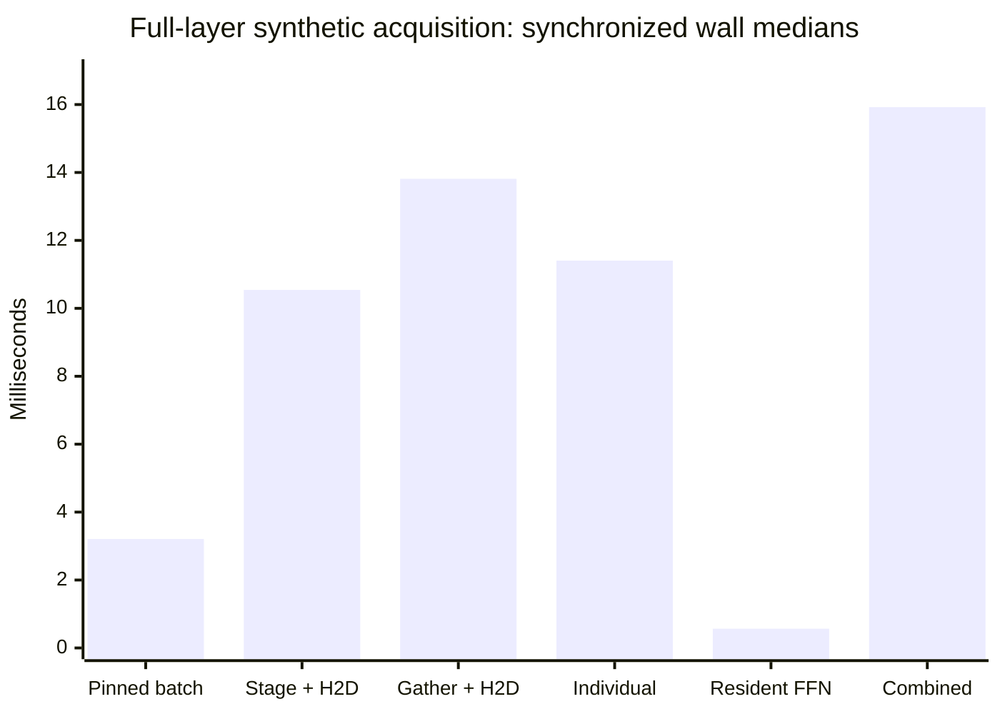
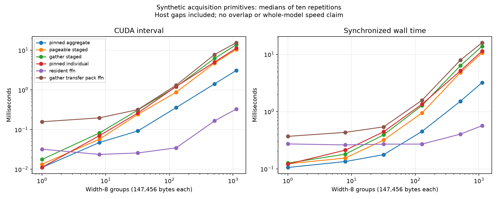

# Hardware-cost findings - Staging and aggregation materially change acquisition costs

This research prerelease completes the bounded hardware-cost experiment in issue #18.
At the full Qwen-shaped layer payload (1,120 width-8 groups, 157.5 MiB), median
synchronized wall times are **3.207 ms** for preaggregated pinned H2D,
**10.544 ms** for pageable staging plus H2D, **13.814 ms** for scattered gathering plus
H2D, **11.405 ms** for individual pinned group copies, **0.566 ms** for resident FFN
execution, and **15.924 ms** for the serialized gather/transfer/packing/FFN path.

These are synthetic primitives on the RTX 5080 Laptop in the original FP32 environment.
They do not measure exposed transfer stalls, overlap, a model pager or inference speed.
All 36 workload/size conditions pass payload or numerical integrity checks before
timing. All 569 raw rows, including warmups, and all 38 timing aggregates are retained.

| Full-layer workload | CUDA interval (ms) | Synchronized wall (ms) |
|---|---:|---:|
| pinned_aggregate | 3.077072 | 3.207250 |
| pageable_staged | 10.409600 | 10.543900 |
| gather_staged | 13.688768 | 13.813800 |
| pinned_individual | 11.196096 | 11.404800 |
| resident_ffn | 0.327568 | 0.566500 |
| gather_transfer_pack_ffn | 15.431056 | 15.923600 |

For this payload, staging/gathering and individual dispatch cost substantially more
than the preaggregated transfer. Preaggregation itself is a startup cost excluded
from the pinned-batch workload; its advantage requires those bytes to be ready in
that layout. The combined path includes GPU packing and FFN computation serially.
Workload differences are observations, not a model of overlap or additive timing.

## Complete measured grid

Each cell is the median of the ten measured repetitions. The three warmups remain in the raw ledger. No condition was rerun or replaced.

| Groups | Workload | Payload MiB | CUDA ms | Wall ms | GPU allocator peak bytes |
|---:|---|---:|---:|---:|---:|
| 1 | pinned_aggregate | 0.140625 | 0.011056 | 0.105500 | 301056 |
| 1 | pageable_staged | 0.140625 | 0.013376 | 0.122500 | 301056 |
| 1 | gather_staged | 0.140625 | 0.017632 | 0.125900 | 301056 |
| 1 | pinned_individual | 0.140625 | 0.011152 | 0.121050 | 301056 |
| 1 | resident_ffn | 0.140625 | 0.031984 | 0.272350 | 8833536 |
| 1 | gather_transfer_pack_ffn | 0.140625 | 0.157264 | 0.368900 | 8833536 |
| 8 | pinned_aggregate | 1.125000 | 0.047152 | 0.133950 | 10885120 |
| 8 | pageable_staged | 1.125000 | 0.057264 | 0.154200 | 10885120 |
| 8 | gather_staged | 1.125000 | 0.082016 | 0.180500 | 10885120 |
| 8 | pinned_individual | 1.125000 | 0.070112 | 0.212000 | 10885120 |
| 8 | resident_ffn | 1.125000 | 0.023568 | 0.261350 | 10897920 |
| 8 | gather_transfer_pack_ffn | 1.125000 | 0.196992 | 0.433500 | 10897920 |
| 32 | pinned_aggregate | 4.500000 | 0.092112 | 0.176900 | 17963008 |
| 32 | pageable_staged | 4.500000 | 0.240928 | 0.318700 | 17963008 |
| 32 | gather_staged | 4.500000 | 0.310640 | 0.392500 | 17963008 |
| 32 | pinned_individual | 4.500000 | 0.261152 | 0.444900 | 17963008 |
| 32 | resident_ffn | 4.500000 | 0.025696 | 0.269800 | 17976320 |
| 32 | gather_transfer_pack_ffn | 4.500000 | 0.317776 | 0.540550 | 17976320 |
| 128 | pinned_aggregate | 18.000000 | 0.357568 | 0.450650 | 46274560 |
| 128 | pageable_staged | 18.000000 | 0.872624 | 0.948150 | 46274560 |
| 128 | gather_staged | 18.000000 | 1.191104 | 1.276750 | 46274560 |
| 128 | pinned_individual | 18.000000 | 1.221024 | 1.348050 | 46274560 |
| 128 | resident_ffn | 18.000000 | 0.034576 | 0.270450 | 46292992 |
| 128 | gather_transfer_pack_ffn | 18.000000 | 1.313264 | 1.577650 | 46292992 |
| 512 | pinned_aggregate | 72.000000 | 1.416640 | 1.515450 | 159520768 |
| 512 | pageable_staged | 72.000000 | 4.710448 | 4.790400 | 159520768 |
| 512 | gather_staged | 72.000000 | 6.206512 | 6.334950 | 159520768 |
| 512 | pinned_individual | 72.000000 | 5.007712 | 5.137500 | 159520768 |
| 512 | resident_ffn | 72.000000 | 0.165440 | 0.403800 | 159576064 |
| 512 | gather_transfer_pack_ffn | 72.000000 | 7.766064 | 7.924150 | 159576064 |
| 1120 | pinned_aggregate | 157.500000 | 3.077072 | 3.207250 | 339351552 |
| 1120 | pageable_staged | 157.500000 | 10.409600 | 10.543900 | 339351552 |
| 1120 | gather_staged | 157.500000 | 13.688768 | 13.813800 | 339351552 |
| 1120 | pinned_individual | 157.500000 | 11.196096 | 11.404800 | 339351552 |
| 1120 | resident_ffn | 157.500000 | 0.327568 | 0.566500 | 339465216 |
| 1120 | gather_transfer_pack_ffn | 157.500000 | 15.431056 | 15.923600 | 339465216 |

## Ranking is a separate implementation opportunity

For 32 tokens x 28 layers x 1,120 unique scores, keeping 1,008 groups, stable argsort/scatter
costs **62.414 ms CUDA / 62.461 ms wall**. Unsorted topk/scatter costs
**24.918 ms CUDA / 24.957 ms wall**. Masks agree on all 896 unique-score fixtures.
Topk is about 2.50 times faster on this fixture. The all-equal-score masks also agree
in this run; one fixture does not establish general tie equivalence. This result does not authorize a semantics-changing
replacement in frozen selectors. It also cannot repair their measured quality failures.

These timings cover ranking only, not the full learned/current-history predictor,
state update, probes, or correction policy. Dividing by 32 gives a descriptive fixture
cost per token across 28 layers; it is not a whole-model decoding benchmark.

## Protocol, evidence and limits

The protocol and apparatus were committed and pushed as
[b1be0e4](https://github.com/displague/dynamic-model-loading/commit/b1be0e4) before timing. The measured grid is 1/8/32/128/512/1,120
groups, six workloads, three warmups and ten measured repetitions. Each group holds
all three width-8 projections at hidden 1,536 in FP32: 147,456 bytes. TF32 is disabled,
four CPU threads are used, and the GPU timing window was isolated from other project
GPU experiments and CPU reviews/tests.

The apparatus preallocates a pageable pool, pinned pool, staging, GPU group storage
and canonical gate/up/down matrices. Allocations, seeded initialization, index planning
and initial preaggregation are outside steady-state timing. The event pair is initialized
and reused. Both clocks cover the full submitted interval; CUDA intervals can contain
host submission gaps. Wall times include Python dispatch and synchronization overhead.
The run does not separately measure cold allocation, long-run variance or thermal effects.

Exact copy checks poison destination/staging first. FFN checks compare with a CPU FP32
reference at the original <=0.01 relative-L2 line. The pool SHA-256, permutation and
input are regenerated independently from the frozen seed. Analysis verifies source
Git blobs, the complete ordered ledger, dimensions, accounting, gates, medians and
ranking tie receipts. Tensor payload bytes and allocator peaks through the repetitions
are reported separately; payload counts are not total process memory.

The complete CPU suite passes 158 tests in both available PyTorch environments. All raw
measurements and source snapshots are small enough to remain in Git, with an indexed
archive and an independently reproduced analysis. No model scoring was performed.

The historical v0.7 resident-FFN selector screen remains unchanged. These measurements
show why that screen alone cannot decide memory-constrained runtime economics:
a future complete policy must pay for its decisions, staging, extra execution and
acquisition using actual avoided critical-path time. Conversely, cheap ranking alone
cannot establish efficient loading. Physical paging/refinement runtime remain gated.

This closes bounded [#18](https://github.com/displague/dynamic-model-loading/issues/18), leaving the Stage 4 runtime milestone,
[#11](https://github.com/displague/dynamic-model-loading/issues/11), causal acquisition [#19](https://github.com/displague/dynamic-model-loading/issues/19) and refinement runtime
[#16](https://github.com/displague/dynamic-model-loading/issues/16) open. No gate threshold is replaced by this characterization.

[Complete 36-condition findings](https://github.com/displague/dynamic-model-loading/blob/v0.9.0/docs/hardware-cost-results.md),
[prospective protocol](https://github.com/displague/dynamic-model-loading/blob/v0.9.0/docs/hardware-cost-protocol.md),
[raw archive and reproduction](https://github.com/displague/dynamic-model-loading/tree/v0.9.0/results/hardware-cost-20260911).
