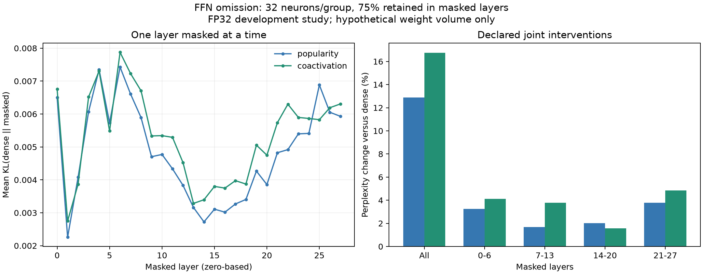

# Per-layer omission findings - 2026-09-11

Omission sensitivity is spread across the model in this development slice. The four
largest individual-layer KL values account for 20.8% of their sum under popularity
packing and 19.6% under co-activation. These descriptive shares do not identify a
small set of layers whose protection would remove most of the grouping penalty.
No layer allocation was selected or evaluated after observing these ranks.

The [protocol](layer-study-protocol.md) and implementation were
[pushed before measurement](https://github.com/displague/dynamic-model-loading/commit/45bfecb).
The study reuses the exact checkpoint, corpus, token IDs, and calibration layouts
from the [packing pilot](packing-pilot-results.md), with the same Python 3.14.3,
PyTorch 2.10.0+cu130, FP32, and RTX 5080 Laptop GPU environment. The 80 calibration
articles were not refitted; the same 16 validation prefixes supply 4,096 input tokens
and 4,080 next-token predictions. No final test data were accessed.

## Complete experiment

All 56 local reconstruction and 32 full-model layout checks passed unchanged limits;
maximum relative logit L2 was 2.174e-6. All 66 declared conditions completed, preserving
1,056 per-document omission rows. The conditions mask each of 28 FFNs individually,
all FFNs together, or four fixed seven-layer blocks, under both layouts, at group
width 32 and 75% retention within the masked layers.

| Diagnostic | Popularity | Co-activation |
|---|---:|---:|
| Individual-layer KL range | 0.002257-0.007428 | 0.002749-0.007875 |
| Individual-layer relative PPL range | 0.998745-1.005952 | 0.998397-1.009445 |
| Sum of 28 individual-layer KL values | 0.135793 | 0.148994 |
| All-layer KL | 0.154117 | 0.179357 |
| All-layer KL / sum of individual KL | 1.1349 | 1.2038 |
| Four largest individual-layer KL indices | 6, 4, 25, 7 | 6, 4, 7, 0 |
| Top-four share of individual KL sum | 20.82% | 19.57% |

Layer indices are zero-based. KL is not additive across interventions: the ratios
above describe the measurements, not a causal decomposition or a guaranteed error
bound. Every single-layer PPL change is below 1% here, while jointly masking all
layers raises perplexity by 12.87% or 16.76%. That observation does not adopt a 1%
quality-equivalence gate. Some isolated omissions improve corpus PPL slightly;
these are reported without implying improved task accuracy or generalization.

Co-activation has lower single-layer KL in four layers (2, 4, 5, and 25), despite
having higher all-layer KL. The complete curve and all metrics remain in the
[raw report](../results/layer-study-20260911/run/report.md).

## Fixed block interventions

Each seven-layer block retains 93.75% of hypothetical FFN weight volume overall.
The all-layer condition retains 75%; these are different omission budgets.

| Masked layers | Popularity KL | Co-activation KL | Popularity relative PPL | Co-activation relative PPL |
|---|---:|---:|---:|---:|
| 0-6 | 0.044247 | 0.045298 | 1.032529 | 1.041212 |
| 7-13 | 0.035334 | 0.040490 | 1.016832 | 1.037939 |
| 14-20 | 0.026509 | 0.031090 | 1.020144 | 1.015668 |
| 21-27 | 0.041229 | 0.049414 | 1.037921 | 1.048367 |
| All 0-27 | 0.154117 | 0.179357 | 1.128710 | 1.167550 |

Popularity has lower KL in every block, but co-activation has lower PPL in layers
14-20. Distributional divergence and likelihood of the observed tokens measure
different effects; neither metric should replace the other after scoring.

All quality metrics in the 32 all-layer per-document control rows reproduce the
parent pilot exactly. The all-layer paired KL difference and exploratory interval
therefore also reproduce: +0.02524, with 95% percentile interval
[+0.01648, +0.03468], 2,000 whole-document resamples and seed 1729. This is a
same-data replication and apparatus check, not independent statistical evidence.

## Accounting, validation, and limitations

A 25% omission in one layer leaves 99.1071% of whole-model FFN weight volume selected;
it does not save 25% of model memory. Unmasked FFNs count at full volume. The denominator
includes all 4,096 processed input positions, whereas quality metrics exclude each
document's final position. Attention and other fixed model weights are outside this
FFN-only volume. Actual execution still holds every weight and uses dense gate/up and
masked dense down projections. No sparse speedup, residency reduction, or transfer
savings were measured.

Review corrected parent metadata anchoring, raw-control verification, incomplete plot
validation, and interruption receipts before measurements. All 38 tests passed and
the focused follow-up review found no blocking issues. The plot validator checks the
full condition/document matrix, intervention metadata, exact raw aggregate receipts,
and recomputed quality metrics. The figure was visually inspected.

The [archive](../results/layer-study-20260911/archive.json) preserves the
[raw ledger](../results/layer-study-20260911/run/results.jsonl),
[summary](../results/layer-study-20260911/run/summary.json),
[manifest](../results/layer-study-20260911/run/manifest.json), exact sources and inputs,
and standalone PNG/SVG figures. Dense reference logits remain in the ignored local
run directory; their hashes are recorded. Model weights are not included in Git.
WikiText excerpts retain their CC BY-SA 3.0 / GFDL source attribution and article
titles in the copied corpus provenance.

This closes the bounded per-layer experiment in issue #7, not Stage 1's multi-domain
held-out gate. It offers no evidence that a small protected-layer set would solve the
grouping loss, and does not rule out a separately calibrated allocation policy.
The next Stage 2 task is the planned transfer-amplification and bounded-cache trace
study, with quality attached to each selection trace and hypothetical traffic labeled
explicitly. A causal predictor or physical pager remains gated on that evidence.
