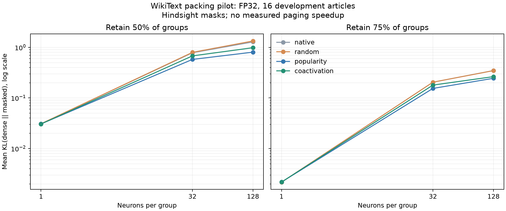

# Packing pilot findings - 2026-09-11

The calibration-only co-activation heuristic did not beat simple popularity packing.
Both lose much of the quality available with individual-neuron selection when
selection must retain whole groups. The BF16 diagnosis isolated an exact but costly
canonical-order control; it did not produce a practical BF16 paging policy.

The [protocol](packing-pilot-protocol.md) was declared before these measurements.
The original numerical thresholds and [initial failures](initial-results.md) remain
unchanged. These are exploratory development results, with no measured speedup or
bounded-memory execution.

## Packing result

The pilot used Qwen2.5-1.5B-Instruct revision
`989aa7980e4cf806f80c7fef2b1adb7bc71aa306` in FP32 on the RTX 5080 Laptop GPU.
Calibration used 80 WikiText training articles (20,480 tokens); diagnostics used 16
validation articles (4,096 input tokens, 4,080 next-token predictions). Each document
is a 256-token prefix. The test split was neither downloaded nor scored.

All 112 local reconstruction checks and 64 full-model layout checks passed the fixed
gates. Maximum full-model relative logit L2 was 2.174e-6. All 24 sparsity configurations
completed, with 384 individual document measurements preserved before aggregation.

At 75% retained groups:

| Layout | Neurons/group | Selected weight fraction | Mean KL | Relative perplexity | Top-1 agreement |
|---|---:|---:|---:|---:|---:|
| Popularity | 1 | 75.00% | 0.002173 | 1.0001 | 97.77% |
| Native | 32 | 75.00% | 0.204588 | 1.1846 | 80.10% |
| Random | 32 | 75.00% | 0.204791 | 1.1663 | 79.68% |
| Popularity | 32 | 75.00% | 0.154117 | 1.1287 | 83.43% |
| Co-activation | 32 | 75.00% | 0.179357 | 1.1676 | 81.13% |
| Popularity | 128 | 75.71% | 0.244443 | 1.2252 | 78.82% |
| Co-activation | 128 | 75.71% | 0.263705 | 1.2423 | 76.64% |

The predeclared comparison, co-activation minus popularity mean KL at width 32 and
75% retention, was **+0.02524**. Its paired whole-document bootstrap 95% percentile
interval was **[+0.01648, +0.03468]** (2,000 replicates, seed 1729). Positive values
favor popularity. This interval describes this small development slice; it is not a
confirmatory inference or a general rejection of co-activation packing.

Popularity also had lower KL, lower perplexity, and higher top-1 agreement in all
four grouped settings (widths 32/128, retention 50%/75%). The full table is preserved
in the [run report](../results/packing-pilot-20260911/pilot/report.md).

The heuristic normalized each neuron's calibration importance profile, used a
64-dimensional random-sign sketch of a 512-token reservoir, and recursively formed
32-neuron groups. This particular representation and grouping method failed to
improve on the simpler baseline; none of its settings were retuned after scoring.
The slight variation between single-neuron layouts remains visible in the full table.

## BF16 numerical diagnosis

Six smoke documents were compared under each arithmetic policy. The two comparisons
are independent: permuted versus native within that policy, and native within that
policy versus the original BF16 output.

| Arithmetic policy | Worst permutation relative L2 | Worst permutation mean KL | Permutation gate | Native versus original gate |
|---|---:|---:|---|---|
| Ordinary BF16 | 0.02959 | 0.001459 | Fail | Pass (exact) |
| Reduced-precision reduction disabled | 0.02059 | 0.001264 | Fail | Fail |
| FP32 down projection, BF16 output | 0.01968 | 0.001226 | Fail | Fail |
| FP32 FFN computation, BF16 output | 0.02091 | 0.001292 | Fail | Fail |
| Down projection restored to original neuron order | 0 | 0 | Pass (exact) | Pass (exact) |

Restoring the original down-projection order reproduced the baseline exactly on all
six documents. This control isolates the down-projection ordering effect in these
runs. It requires inverse gathers of activations and weights and has no performance
claim. Neither disabling reduced-precision reduction nor materializing FP32 FFN
temporaries was enough to pass the existing limits. The FP32 packing pilot therefore
remains a separate control, not evidence that the original BF16 failure was resolved.

## Review correction and evidence

Review found that WikiText table legends and inline equations can resemble article
titles. The original parser recognized 629 training boundaries instead of 600.
The corrected parser requires blank rows before and after a top-level title and
also prevents duplicate selected titles. Validation retained 60 boundaries.

A fresh corpus build after the fix produced byte-identical corpus and provenance
files. All 96 selected prefixes were unaffected, so the GPU measurements above were
retained without rescoring. Both parser versions and the hash comparison are archived
in the [corpus audit](../results/packing-pilot-20260911/corpus-audit/audit.json). This is
a documented implementation correction, not a post-score change to the selected data.

The precision runner initially omitted token-ID and exact permutation receipts.
After adding them before measurement, a fresh diagnostic run reproduced the complete
60-row ledger and summary byte for byte. The original run remains in `precision/`;
the corrected run is in `precision-receipted/`. Its exact permutations also match
those from the initial BF16 experiment. See the
[repeat audit](../results/packing-pilot-20260911/precision-repeat-audit.json).

Receipts include the [raw pilot ledger](../results/packing-pilot-20260911/pilot/results.jsonl),
[pilot manifest](../results/packing-pilot-20260911/pilot/manifest.json),
[precision ledger](../results/packing-pilot-20260911/precision-receipted/results.jsonl),
[precision summary](../results/packing-pilot-20260911/precision-receipted/summary.json), and
[paired comparison](../results/packing-pilot-20260911/analysis/comparison.json).
Source snapshots preserve the code actually used, including the original parser.
Layout arrays are compressed losslessly as `layouts.json.gz`; their decompressed
SHA256 matches the raw ledger. Large reference logits remain in ignored local runs
and are omitted from the Git archive. They are reproducible dense outputs.

The corpus excerpts come from [Salesforce/WikiText](https://huggingface.co/datasets/Salesforce/wikitext),
revision `b08601e04326c79dfdd32d625aee71d232d685c3`. Article titles and source-file hashes
are retained in the [provenance](../results/packing-pilot-20260911/pilot/corpus-provenance.json).
The excerpts are distributed under the dataset's CC BY-SA 3.0 / GFDL attribution.

## Implication for the next stage

Group selection still computes dense gate/up activations and a masked dense down
projection with all weights resident. Weight fractions in the table describe
hypothetical selected FFN weights, not physical transfers or achieved memory savings.
The importance score is a hindsight heuristic, not an optimal selector or a causal
predictor. No cache, paging runtime, or omission detector was evaluated.

The next useful measurement is a per-layer omission study: determine whether quality
loss is concentrated in a few layers before changing the packing heuristic. That
requires a new declared protocol and fresh measurements. A pager is not yet justified
by these results alone.
