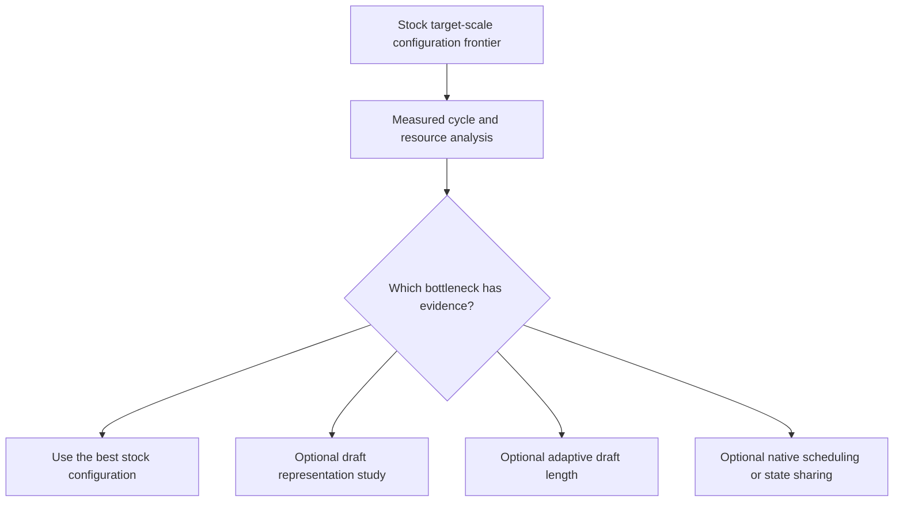
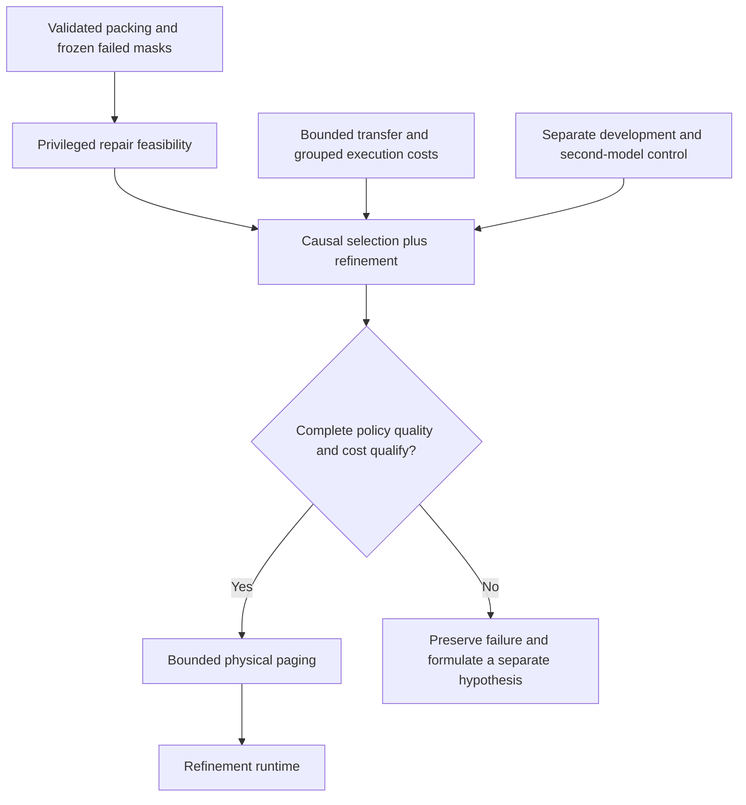

# Research plan and delivery history

This roadmap reconstructs the staged course in the final critical review of the
[original research conversation](https://chatgpt.com/share/6aa40208-727c-83e9-a91b-b2ce031c96eb).
It was recorded retrospectively on 2026-09-11. The original experiment protocols were
written before their measurements; this roadmap is not a retroactive preregistration.

The question is whether a dense FFN's useful computation survives physical grouping,
can be selected cheaply from causally available information, and can be executed with
less real data movement under a bounded memory budget. Corrective refinement is a
separate hypothesis. A residency miss is observable; an omitted important group can
silently damage quality without causing a residency miss.

## Primary program after v0.12

[ADR 0003](adr/0003-verified-speculation-boundary.md) retires the tested Qwen 1.5B
FP32 grouped per-token execution/repair path as the primary engineering strategy.
This is an opportunity-cost decision, not an impossibility result. All historical
measurements, failed gates and issue descriptions remain available.

The immediate commitment is a [stock llama.cpp comparison](stock-speculation-protocol.md)
on an actually offloaded Qwen2.5-32B-Instruct Q4_K_M target. Compare target-only,
small resident drafts and a feasible non-sharing low-bit target draft; optimize
target residency and draft memory together. Measure sustained generation alongside
the old scalar correctness fixtures. Preserve a fixed target-only greedy reference.

The branches are alternatives, not mandatory sequential gates. Small-model utility
Gate A does not gate exact-runtime research. CPU selected-row kernels, further
repair-estimator tuning and shared-resident implementation are not prerequisites.
Keep physical pager #11, refinement runtime #16 and old-scope #19 closed as not
planned under the superseded design; completed v0.12 issue #22 stays completed.
Other unfinished old-stage investigations are deferred, with hypotheses unresolved.

Current work: [stock benchmark #23](https://github.com/displague/dynamic-model-loading/issues/23),
[measured cycle/resource model #24](https://github.com/displague/dynamic-model-loading/issues/24),
[optional representations #25](https://github.com/displague/dynamic-model-loading/issues/25),
and [optional adaptive speculation #26](https://github.com/displague/dynamic-model-loading/issues/26).
The [v0.13.0 preparation delivery](releases/v0.13.0.md) records the decision and
pinned substrate. The project owner resolved the storage constraint on 2026-09-12;
all target/draft GGUF files are now acquired and verified. The
[native runner](stock-speculation-runner.md) receives a clean pushed preregistration
before calibration and evaluation. No target-scale performance has been measured
at this preparation point.

## Historical roadmap

The following stage table, dependencies and release narratives describe the earlier
program. Statements of remaining work below are historical research questions,
not prerequisites for the new stock benchmark. ADR 0003 governs current priorities.

## Original stages and recorded evidence

| Stage | Deliverable and exit gate | Current evidence / remaining work |
|---|---|---|
| 0. Reproducible reference | Dense and physically repacked outputs agree under declared tolerances; record timing, memory, and provenance. | FP32 passes. BF16 permutation fails in both torch 2.10 and 2.12; canonical down order is exact within each environment but costly. The 2.10 repeat reproduces all 60 historical rows. The OPT ReLU positive control passes: 96.04% exact-zero neurons; grouping increases selected volume. Practical BF16 policy remains open. |
| 1. Hindsight sparsity envelope | Individual-neuron and per-layer/multi-layer omission curves on whole-document and domain splits; useful sparsity survives unseen inputs. | Smoke, a 16-article Wikipedia slice, and 66 per-layer/joint conditions exist. Sensitivity is distributed on this slice. A separate ten-task balanced development control on Qwen and OPT is recorded in v0.10; multi-domain held-out quality remains open. |
| 2. Physical packing and cache traces | Quality versus transferred bytes and transfer amplification at 256/512 MiB and 1/2 GiB FFN-cache budgets. | All 72 declared conditions and 1,152 traces completed. Popularity/width 8/90% retention is the only condition passing the prospective development screen; best warm traffic saving is 15.54% at 2 GiB. This is reused-data simulation; held-out quality and physical transfers remain open. |
| 3. Causal prediction | Static hot-set, recency, EMA, and learned-selector quality/bytes/cost curves; savings pay for prediction, including approximate closed-loop inference. | The first frozen-point experiment is complete: all four causal selectors fail quality on all 16 articles. Aggregate relative PPL is 1.089204-1.158203; all meet the simulated traffic screen, but three adaptive selectors also fail cost. Incremental hindsight reaches 1.009318 and cannot qualify. Broader predictor curves and held-out feasibility remain open. |
| 4. RAM-to-VRAM execution | Explicit bounded slots, pinned staging, actual skipped reads/computation; beat the strongest same-budget baseline after all costs. | Physical paging remains gated on a qualifying complete causal policy, which may include refinement. v0.9 primitive characterization and v0.12 exact-size complete-action costs are recorded; neither is a model pager or an end-to-end result. |
| 5a. Analytical refinement feasibility | Determine whether failed initial selections admit economical repair, then whether a causal signal can request it; compare complete policies with larger initial subsets. | v0.8 completes the first fixed-mask diagnostic: five privileged repair settings pass aggregate quality/traffic on two reused prefixes, one also passes both individual quality lines. No larger one-shot setting passes both. v0.12 tests causal repair on its own corrected trajectories: aggregate quality improves at matched bytes, but the individual-prefix advantage and combined quality/economics gates fail. Complete-policy feasibility remains open. |
| 5b. Refinement runtime | Preserve the FFN input, add acquired contributions before downstream commitment, and improve silent-failure risk versus total bytes/latency with bounded fallback. | Still gated on analytical feasibility of the complete causal policy and bounded execution. Define unsafe omission before scoring; local audit norms are not a validated detector. |

The original longer-term milestone follows these stages: repeat on a 7B-class model
and another family, then study quantization, heterogeneous groups, and limited
lookahead independently. Low-rank residuals and training for block structure are
representation experiments, not assumed runtime improvements. SSD/NVMe experiments
must measure actual storage reads and cache behavior. MTP, Bayesian state, conversational
memory, and an always-on service remain deferred.

## Revised dependencies after the v0.7 design review

[ADR 0001](adr/0001-selection-and-refinement-gates.md) changes the dependency graph
prospectively. The failed one-shot selectors can now be starting points for analytical
repair. The published v0.7 decision remains intact. Its frozen 10% resident-FFN cost
screen does not become a universal necessary condition for paged inference.

The [first repair protocol](refinement-feasibility-protocol.md) uses all four v0.7
starting masks on the first two development articles, 128 tokens each. It compares
privileged and resident-first repairs with larger one-shot subsets, charging selector
storage, added cold traffic and resident computation. Fixed old masks on corrected
paths are counterfactual. No privileged point can nominate a runtime.

The next causal experiment must test whether the repair signal is available from
current FFN input, previous execution state, an innovation/change signal and residency,
with explicitly charged probes. Include safe-to-omit abstention and dense fallback;
judge the completed output rather than requiring the initial output to pass.

In parallel as research workstreams, permit one small second-model/new-development
control and a hardware microbenchmark. The separate development mix is balanced code,
data extraction, arithmetic, copying and topic changes, as selected by the project
owner. Freeze all inputs and scoring before either model runs; this does not close
the broader held-out quality gate. Serialize GPU measurements to avoid contention.

Keep BF16 bounded: compare candidate grouped policies against a common higher-precision
reference and prospective downstream criteria, without replacing the original
mathematical controls. Do not launch further library-version sweeps by default.

Deferred branches now have explicit entry evidence: hierarchical acquisition requires
cheap coarse rejection; persistent execution state requires measured benefit over
current-input-only prediction; variable precision/residuals require a useful combined
quality/byte frontier; MTP/lookahead requires affordable acquisition and causality
checks; an always-on service requires a runtime that benefits from persistent residency.

## Releases are experiment deliveries

| Release | Scope | Finding |
|---|---|---|
| [v0.1.0](releases/v0.1.0.md) | Reference apparatus, original BF16 failure, separate FP32 control | Correct paired packing in FP32; grouping loses much of individual-neuron quality. |
| [v0.2.0](releases/v0.2.0.md) | Larger packing pilot and arithmetic diagnosis | Tested co-activation heuristic loses in every grouped setting; canonical BF16 order is exact. |
| [v0.3.0](releases/v0.3.0.md) | Per-layer omission sensitivity and interaction diagnosis | Top-four layers account for 20.8% / 19.6% of single-layer KL sums; all-layer controls reproduce exactly. |
| [v0.4.0](releases/v0.4.0.md) | Applied-mask traces, transfer amplification, and bounded-cache simulation | One of 72 conditions passes the development screen; best simulated warm saving 15.54%, relative PPL 1.008978. |
| [v0.5.0](releases/v0.5.0.md) | Same-interpreter torch 2.12 arithmetic control | Four policies still fail; canonical down is exact within each environment; ordinary BF16 outputs drift across environments. |
| [v0.6.0](releases/v0.6.0.md) | OPT ReLU positive control | 96.04% exact-zero neurons; popularity width-128 exact-zero selection needs 60.40% of FFN bytes. |
| [v0.7.0](releases/v0.7.0.md) | Causal selection at the frozen Qwen operating point | No nominee: four quality failures; recency/EMA/learned also exceed the 10% selector-cost screen. All 307 raw rows, 85 document masks and 20 generated paths are retained. |
| [v0.8.0](releases/v0.8.0.md) | Privileged and resident-first correction from failed initial masks | Five of 48 repair settings pass aggregate quality/traffic; one also passes both prefixes. None of 20 larger one-shot settings passes both. No causal or runtime nominee. |
| [v0.9.0](releases/v0.9.0.md) | Synthetic transfer, staging, grouped FFN and ranking costs | All 36 primitive conditions pass integrity; full-layer wall transfer ranges from 3.207 ms preaggregated to 13.814 ms gathered, combined path 15.924 ms. No model runtime claim. |
| [v0.10.0](releases/v0.10.0.md) | Separate balanced development tasks on Qwen and OPT | Ten fixed tasks cover five domains, with exact targets, answer-only metrics and retained generations. Model-specific numerical controls and every result are reported; no held-out or runtime nomination. |
| [v0.11.0](releases/v0.11.0.md) | Dense chat-interface and path qualification | 7/10 debug, 12/20 fresh successes; all dense paths agree, but Gate A fails. |
| [v0.12.0](releases/v0.12.0.md) | Own-trajectory causal repair and complete action costs | Partial evidence improves aggregate quality at matched bytes, but individual-prefix advantage and combined quality/economics gates fail. |

No completed delivery establishes an inference speedup or achieved memory reduction.
The stage milestones remain open where their full gates have not been met. The
machine-readable [GitHub plan](planning/github-plan.json) records issue scope and
milestone definitions; [GitHub](https://github.com/displague/dynamic-model-loading/milestones)
tracks live status.

## Evaluation and publication rules

Preserve the original 0.01 relative-L2 and 0.001 KL numerical gates. These are packing
correctness limits, not general sparse-quality equivalence. Any task/PPL quality
tolerance must be declared before its evaluation; the conversation's illustrative
1% PPL / one percentage-point task limits and 20% runtime improvement are proposed
management gates, not adopted success claims or predictions.
The v0.4 protocol prospectively adopts aggregate relative PPL <=1.01 and >=10% warm
simulated traffic reduction for a development feasibility screen only. It does not
adopt or satisfy deployment/task/runtime gates; 9/16 articles at the nominated
condition individually exceed 1% PPL increase.

The v0.7 protocol retains that nominated condition and adds an affordability screen:
both CUDA and synchronized wall selector-time medians must be <=10% of the paired
resident dense-FFN medians. All four causal selectors fail the unchanged quality
screen; no final-test evaluation, new retention choice, or runtime build follows from
this result. Completing bounded experiment #15 leaves broader predictor issue #10
open. A new predictor, retention sweep or scale control requires a fresh prospective
protocol, not replacement of these failed rows.

Charge fixed weights, FFN cache, KV, predictor, staging, workspaces, and other GPU
allocations separately. Selected weight volume is neither transferred bytes nor cache
capacity. Report prefill and decode separately, and evaluate cold/warm conditions,
topic switches, context length, and batching when their stage is reached. Include
optimized quantized resident models and smaller-model utility comparisons later.

Every release retains a detailed Markdown note, annotated tag, GitHub release, raw
receipts, validation, and an explicit remaining-work statement. Completed phases are
pushed. Commit messages explain findings to collaborators rather than narrating an
interactive session. Historical protocol/source snapshots are immutable.

The measured baseline remains Python 3.14.3 / torch 2.10.0+cu130. The completed
same-interpreter v0.5 control uses torch 2.12.0+cu130 with matching torchvision 0.27.0;
all other effective package versions are aligned. Four arithmetic policies still
fail and ordinary native BF16 outputs drift across environments. Retain the baseline
and record future environments separately. Both project suites pass; optional shared
audio packages are outside this text-model validation.

## Post-v0.10 interface qualification

The v0.11.0 prospective chat-interface experiment recovers 7/10 debug and 12/20
fresh successes, with complete native/incremental/repacked fidelity, but fails its
frozen balanced Gate A. See [the results](dense-interface-results.md) and
[the three-gate decision](adr/0002-qualified-utility-and-causal-evidence.md).
The original v0.10 result is preserved. Analytical repair #19 continues under
Gates B/C; useful balanced behavior and physical runtime remain separate open gates.

## Complete causal-policy evidence after v0.12

v0.12.0 / #22 completes the ten-policy own-trajectory diagnostic. At 28 additions, partial evidence gives relative PPL 1.089487, versus 1.112546 one-shot and 1.107101 predetermined; the individual-prefix advantage rule fails. No policy passes both completed quality and fully charged traffic/cost gates. All raw rows, task continuations and primitive timings are retained. Broader complete-policy feasibility and physical runtime remain open.

See [all findings](causal-evidence-results.md) and [all curves and individual failures](causal-evidence-tables.md). Gate A remains independent; physical paging remains gated.

The three-gate interpretation after ADR 0002 is:

~~~mermaid
flowchart TD
    A[Dense interface and task qualification] --> U{Gate A passes?}
    U -->|Yes| V[Qualified utility preservation evaluation]
    U -->|No| W[New prospective baseline study]
    B[Complete causal policy on its own trajectory] --> G{Gates B and C both pass?}
    C[Fully charged acquisition actions] --> G
    G -->|Yes| P[Bounded physical-runtime experiment]
    G -->|No| N[Preserve result and formulate a new hypothesis]
~~~

Gate A failure blocks qualified utility claims without cancelling analytical repair.
Passing the synthetic cost screen would justify an experiment, not an achieved
runtime gain. At v0.12 no policy satisfies the combined B/C gate.
