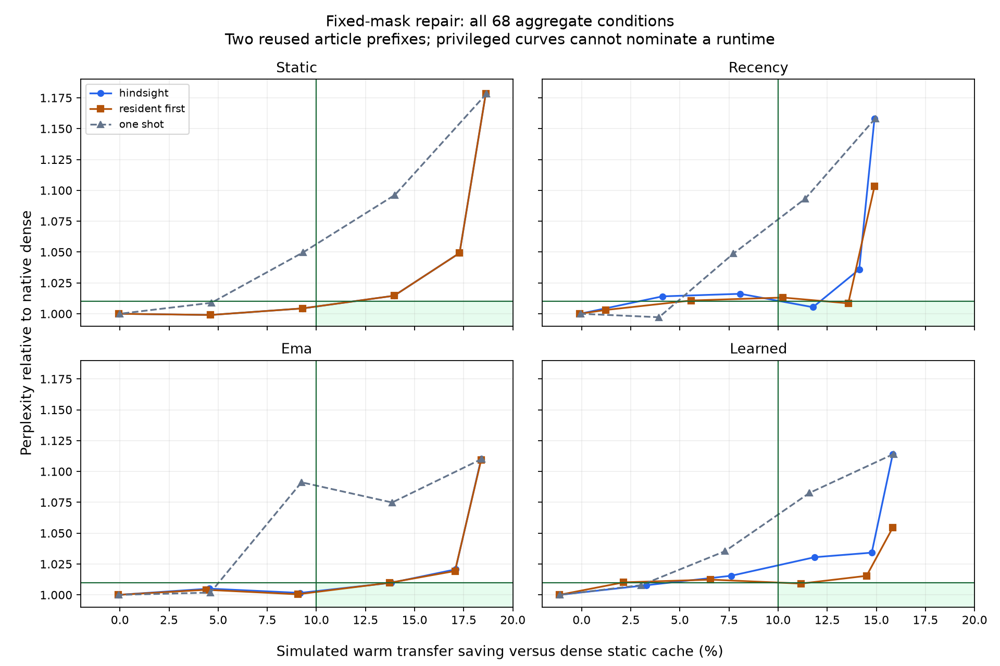

# Fixed-mask refinement feasibility: complete diagnostic findings

The complete policy is the unit of feasibility. A failed first pass need not block
analytical correction. The v0.7 failures remain frozen; this prospective experiment
asks a separate question on two fixed 128-token development prefixes.

| Initial selector / repair schedule | Additions per layer visit (resident + cold) | Final FFN fraction | Relative PPL | Warm saving | Article passes |
|---|---:|---:|---:|---:|---:|
| recency-hindsight-28 | 9.213 + 18.787 | 92.500% | 1.005318 | 11.774% | 2/2 |
| recency-resident_first-8 | 22.042 + 8.000 | 92.682% | 1.008490 | 13.572% | 1/2 |
| ema-hindsight-28 | 0.436 + 27.564 | 92.500% | 1.009740 | 13.792% | 1/2 |
| ema-resident_first-28 | 1.157 + 28.000 | 92.603% | 1.009784 | 13.719% | 1/2 |
| learned-resident_first-28 | 10.136 + 27.951 | 93.401% | 1.009158 | 11.177% | 1/2 |

Five of 48 repair settings meet the aggregate quality/traffic lines; no fresh
one-shot setting at 90, 92.5, 95, 97.5 or 100% meets both. Only recency-hindsight-28
also passes on both individual prefixes among those five. The sample is too small
and reused to establish generalization; these are descriptive screens, not confidence
bounds. Below-dense NLL on a prefix can offset deterioration on the other.

The grouping remains Qwen FP32 popularity, width 8, 1,120 groups/layer, 28 layers.
Hindsight repairs use abs(z)*down-column-norm scores, stable group-index ties, and
limits 0/8/28/56/84/112 on the 112 initially omitted groups. Resident-first adds all
omitted resident groups then applies that limit to cold groups. Both use fixed v0.7
initial masks on the corrected trajectory and are explicitly privileged.

The zero/full repair controls and fresh original-selector reproduction all pass.
The complete 56 controls and 260 ledger rows are retained. Independent analysis checks
144 trace payloads, including the omitted-score rank order, disjoint repair unions,
all reference receipts and cache costs. It does not recreate every candidate logit
from weights; candidate metrics are recorded measurements. Ten dense/original-causal
reference payloads support reference-side NLL and numerical controls.

The green area satisfies the two aggregate diagnostic lines. Lines connect the fixed
budget grid, not intermediate measured settings. Static resident-first and hindsight
coincide because static initial selection already includes the resident core.
More additions can worsen NLL: the full downstream trajectory changes and the
contribution heuristic is not an NLL optimizer. No monotonic guarantee is assumed.

## Residency, work and costs

Learned resident-only correction moves relative PPL from 1.114143 to 1.054495 while
adding no cold traffic at the same charged cache capacity. It adds 10.136 groups per
layer visit on average. Resident-first with 28 cold groups reaches 1.009158 with
93.401% FFN volume, 2.049013 GiB/input warm traffic, 11.177% saving and 0.107479 GiB/input
incremental cold volume. The second article remains 2.307% worse than dense.

Recency resident-first 8 restores 22.042 resident + 8 cold groups per layer visit;
only 0.030762 GiB/input additional cold volume yields aggregate 1.008490, but the
individual ratios 0.989118/1.028240 caution against treating this as broad quality.
Recency hindsight 28 instead passes both prefixes at 1.002266/1.008380, with 11.774%
aggregate warm saving. This schedule adds 9.213 resident + 18.787 cold groups on average.

The initial selector's persistent storage plus 1,034,880 bytes of repair metadata is
reserved from 2 GiB before selecting a static equal-layer hot set. An incoming group is
reserved too. All transfers below are simulated FFN-cache traffic, measured per input
token; quality uses 254 next-token predictions across 256 input visits. Resident repair
is free only in additional transfer bytes. It consumes group computation and is not
free latency. All-weight model and restoration copies, dense gate/up work and audits
remain in the implementation. No achieved VRAM saving, physical transfer saving,
repair overhead or tokens-per-second claim follows. Startup costs are excluded.

The full-budget dense static comparison is 2.306854 GiB/input. Fresh one-shot masks
are rolled out causally at each retained fraction, with original selector storage
charged but no repair metadata. Fixed-mask repair keeps original 90% masks even after
inputs change: the curves are useful diagnostics, not equivalent deployed policies.

## Complete condition grid

Fractions count all three FFN projections; all groups have equal bytes. Resident and
cold additions are groups per layer visit. A dash means a fresh one-shot rollout.
Warm saving includes predictor/repair capacity charges. Article counts use the same
<=1.01 quality line, independently of the aggregate screen.

| Condition | Relative PPL | Article 1 | Article 2 | Warm GiB/input | Saving | FFN volume | Resident + cold additions | Aggregate screen |
|---|---:|---:|---:|---:|---:|---:|---:|---|
| static-hindsight-0 | 1.1783998 | 1.1127401 | 1.2479339 | 1.877289 | 18.621% | 90.000% | 0.000 + 0.000 | Fail |
| static-hindsight-8 | 1.0492320 | 1.0496148 | 1.0488494 | 1.908051 | 17.288% | 90.714% | 0.000 + 8.000 | Fail |
| static-hindsight-28 | 1.0146007 | 1.0217581 | 1.0074934 | 1.984955 | 13.954% | 92.500% | 0.000 + 28.000 | Fail |
| static-hindsight-56 | 1.0043280 | 1.0049552 | 1.0037013 | 2.092621 | 9.287% | 95.000% | 0.000 + 56.000 | Fail |
| static-hindsight-84 | 0.9990356 | 1.0047000 | 0.9934032 | 2.200287 | 4.620% | 97.500% | 0.000 + 84.000 | Fail |
| static-hindsight-112 | 1.0000000 | 1.0000002 | 0.9999997 | 2.307953 | -0.048% | 100.000% | 0.000 + 112.000 | Fail |
| static-resident_first-0 | 1.1783998 | 1.1127401 | 1.2479339 | 1.877289 | 18.621% | 90.000% | 0.000 + 0.000 | Fail |
| static-resident_first-8 | 1.0492320 | 1.0496148 | 1.0488494 | 1.908051 | 17.288% | 90.714% | 0.000 + 8.000 | Fail |
| static-resident_first-28 | 1.0146007 | 1.0217581 | 1.0074934 | 1.984955 | 13.954% | 92.500% | 0.000 + 28.000 | Fail |
| static-resident_first-56 | 1.0043280 | 1.0049552 | 1.0037013 | 2.092621 | 9.287% | 95.000% | 0.000 + 56.000 | Fail |
| static-resident_first-84 | 0.9990356 | 1.0047000 | 0.9934032 | 2.200287 | 4.620% | 97.500% | 0.000 + 84.000 | Fail |
| static-resident_first-112 | 1.0000000 | 1.0000002 | 0.9999997 | 2.307953 | -0.048% | 100.000% | 0.000 + 112.000 | Fail |
| static-one_shot-0.9 | 1.1783998 | 1.1127401 | 1.2479339 | 1.876328 | 18.663% | 90.000% | - | Fail |
| static-one_shot-0.925 | 1.0962844 | 1.0289739 | 1.1679981 | 1.983994 | 13.996% | 92.500% | - | Fail |
| static-one_shot-0.95 | 1.0497689 | 1.0109828 | 1.0900429 | 2.091660 | 9.328% | 95.000% | - | Fail |
| static-one_shot-0.975 | 1.0089046 | 0.9943908 | 1.0236303 | 2.199326 | 4.661% | 97.500% | - | Fail |
| static-one_shot-1 | 0.9999999 | 1.0000001 | 0.9999997 | 2.306992 | -0.006% | 100.000% | - | Fail |
| recency-hindsight-0 | 1.1582812 | 1.0740325 | 1.2491386 | 1.963007 | 14.905% | 90.000% | 0.000 + 0.000 | Fail |
| recency-hindsight-8 | 1.0359592 | 1.0068191 | 1.0659427 | 1.980927 | 14.129% | 90.714% | 3.340 + 4.660 | Fail |
| recency-hindsight-28 | 1.0053185 | 1.0022665 | 1.0083798 | 2.035247 | 11.774% | 92.500% | 9.213 + 18.787 | Pass (privileged) |
| recency-hindsight-56 | 1.0161632 | 1.0226430 | 1.0097245 | 2.120495 | 8.079% | 95.000% | 15.043 + 40.957 | Fail |
| recency-hindsight-84 | 1.0140939 | 1.0156013 | 1.0125888 | 2.211961 | 4.114% | 97.500% | 19.256 + 64.744 | Fail |
| recency-hindsight-112 | 0.9999999 | 1.0000002 | 0.9999997 | 2.308914 | -0.089% | 100.000% | 22.042 + 89.958 | Fail |
| recency-resident_first-0 | 1.1031698 | 1.0307791 | 1.1806444 | 1.963007 | 14.905% | 91.968% | 22.042 + 0.000 | Fail |
| recency-resident_first-8 | 1.0084897 | 0.9891183 | 1.0282404 | 1.993769 | 13.572% | 92.682% | 22.042 + 8.000 | Pass (privileged) |
| recency-resident_first-28 | 1.0131346 | 1.0048091 | 1.0215290 | 2.070673 | 10.238% | 94.468% | 22.042 + 28.000 | Fail |
| recency-resident_first-56 | 1.0107488 | 1.0174454 | 1.0040964 | 2.178280 | 5.574% | 96.967% | 22.042 + 55.985 | Fail |
| recency-resident_first-84 | 1.0030634 | 0.9991637 | 1.0069784 | 2.278730 | 1.219% | 99.299% | 22.042 + 82.108 | Fail |
| recency-resident_first-112 | 0.9999999 | 1.0000002 | 0.9999997 | 2.308914 | -0.089% | 100.000% | 22.042 + 89.958 | Fail |
| recency-one_shot-0.9 | 1.1582812 | 1.0740325 | 1.2491386 | 1.962097 | 14.945% | 90.000% | - | Fail |
| recency-one_shot-0.925 | 1.0932874 | 1.0949646 | 1.0916128 | 2.044278 | 11.382% | 92.500% | - | Fail |
| recency-one_shot-0.95 | 1.0487490 | 1.0604521 | 1.0371750 | 2.128687 | 7.723% | 95.000% | - | Fail |
| recency-one_shot-0.975 | 0.9971805 | 0.9940008 | 1.0003703 | 2.215973 | 3.940% | 97.500% | - | Fail |
| recency-one_shot-1 | 0.9999999 | 1.0000001 | 0.9999997 | 2.307953 | -0.048% | 100.000% | - | Fail |
| ema-hindsight-0 | 1.1102405 | 1.1122396 | 1.1082451 | 1.882699 | 18.387% | 90.000% | 0.000 + 0.000 | Fail |
| ema-hindsight-8 | 1.0206289 | 1.0393712 | 1.0022246 | 1.912838 | 17.080% | 90.714% | 0.162 + 7.838 | Fail |
| ema-hindsight-28 | 1.0097403 | 1.0058433 | 1.0136524 | 1.988688 | 13.792% | 92.500% | 0.436 + 27.564 | Pass (privileged) |
| ema-hindsight-56 | 1.0015894 | 1.0085605 | 0.9946664 | 2.095230 | 9.174% | 95.000% | 0.729 + 55.271 | Fail |
| ema-hindsight-84 | 1.0050488 | 1.0110209 | 0.9991120 | 2.201944 | 4.548% | 97.500% | 0.976 + 83.024 | Fail |
| ema-hindsight-112 | 1.0000001 | 1.0000003 | 0.9999999 | 2.308914 | -0.089% | 100.000% | 1.157 + 110.843 | Fail |
| ema-resident_first-0 | 1.1093830 | 1.1086427 | 1.1101238 | 1.882699 | 18.387% | 90.103% | 1.157 + 0.000 | Fail |
| ema-resident_first-8 | 1.0193070 | 1.0355423 | 1.0033262 | 1.913461 | 17.053% | 90.818% | 1.157 + 8.000 | Fail |
| ema-resident_first-28 | 1.0097843 | 1.0101373 | 1.0094314 | 1.990365 | 13.719% | 92.603% | 1.157 + 28.000 | Pass (privileged) |
| ema-resident_first-56 | 1.0004828 | 1.0092657 | 0.9917763 | 2.098031 | 9.052% | 95.103% | 1.157 + 56.000 | Fail |
| ema-resident_first-84 | 1.0041247 | 1.0119827 | 0.9963277 | 2.205697 | 4.385% | 97.603% | 1.157 + 84.000 | Fail |
| ema-resident_first-112 | 1.0000001 | 1.0000003 | 0.9999999 | 2.308914 | -0.089% | 100.000% | 1.157 + 110.843 | Fail |
| ema-one_shot-0.9 | 1.1102405 | 1.1122396 | 1.1082451 | 1.881738 | 18.428% | 90.000% | - | Fail |
| ema-one_shot-0.925 | 1.0748587 | 1.0726909 | 1.0770309 | 1.987230 | 13.855% | 92.500% | - | Fail |
| ema-one_shot-0.95 | 1.0912196 | 1.0647222 | 1.1183764 | 2.093596 | 9.245% | 95.000% | - | Fail |
| ema-one_shot-0.975 | 1.0018525 | 0.9800835 | 1.0241049 | 2.200576 | 4.607% | 97.500% | - | Fail |
| ema-one_shot-1 | 0.9999999 | 1.0000001 | 0.9999997 | 2.307953 | -0.048% | 100.000% | - | Fail |
| learned-hindsight-0 | 1.1141426 | 1.0359340 | 1.1982556 | 1.941534 | 15.836% | 90.000% | 0.000 + 0.000 | Fail |
| learned-hindsight-8 | 1.0342098 | 1.0009238 | 1.0686027 | 1.966237 | 14.765% | 90.714% | 1.576 + 6.424 | Fail |
| learned-hindsight-28 | 1.0305252 | 0.9947135 | 1.0676262 | 2.033285 | 11.859% | 92.500% | 4.139 + 23.861 | Fail |
| learned-hindsight-56 | 1.0155120 | 1.0024588 | 1.0287352 | 2.131025 | 7.622% | 95.000% | 6.720 + 49.280 | Fail |
| learned-hindsight-84 | 1.0077929 | 1.0114833 | 1.0041160 | 2.231050 | 3.286% | 97.500% | 8.708 + 75.292 | Fail |
| learned-hindsight-112 | 1.0000000 | 1.0000001 | 0.9999998 | 2.333221 | -1.143% | 100.000% | 10.136 + 101.864 | Fail |
| learned-resident_first-0 | 1.0544950 | 1.0288321 | 1.0807979 | 1.941534 | 15.836% | 90.905% | 10.136 + 0.000 | Fail |
| learned-resident_first-8 | 1.0154330 | 0.9981952 | 1.0329685 | 1.972293 | 14.503% | 91.619% | 10.136 + 7.999 | Fail |
| learned-resident_first-28 | 1.0091580 | 0.9954339 | 1.0230713 | 2.049013 | 11.177% | 93.401% | 10.136 + 27.951 | Pass (privileged) |
| learned-resident_first-56 | 1.0123550 | 1.0108484 | 1.0138639 | 2.155478 | 6.562% | 95.873% | 10.136 + 55.639 | Fail |
| learned-resident_first-84 | 1.0101470 | 1.0118933 | 1.0084036 | 2.257540 | 2.138% | 98.243% | 10.136 + 82.182 | Fail |
| learned-resident_first-112 | 1.0000000 | 1.0000001 | 0.9999998 | 2.333221 | -1.143% | 100.000% | 10.136 + 101.864 | Fail |
| learned-one_shot-0.9 | 1.1141426 | 1.0359340 | 1.1982556 | 1.940595 | 15.877% | 90.000% | - | Fail |
| learned-one_shot-0.925 | 1.0826533 | 1.0061861 | 1.1649316 | 2.039241 | 11.601% | 92.500% | - | Fail |
| learned-one_shot-0.95 | 1.0354163 | 0.9985521 | 1.0736415 | 2.138442 | 7.301% | 95.000% | - | Fail |
| learned-one_shot-0.975 | 1.0078569 | 1.0001963 | 1.0155762 | 2.237138 | 3.022% | 97.500% | - | Fail |
| learned-one_shot-1 | 0.9999999 | 1.0000001 | 0.9999997 | 2.332260 | -1.101% | 100.000% | - | Fail |

## Next evidence required

The results support testing causal repair, including current-input evidence with
observed temporal state and residency. Keep original one-shot failures and their
rules. Compare the complete corrected policy with larger initial selection, a static
resident core and explicit dense fallback; charge probes, state, decisions and
additional acquisition. Physical paging/refinement runtime stay gated. A useful
privileged curve does not identify the required observable repair signal.

Hardware primitives and the separate balanced code/extraction/arithmetic/copying/topic
change development control have independent protocols. Neither is a substitute for
held-out complete-policy evaluation. See [release notes](releases/v0.8.0.md) and
[archive restoration](../results/repair-control-20260911/README.md).
