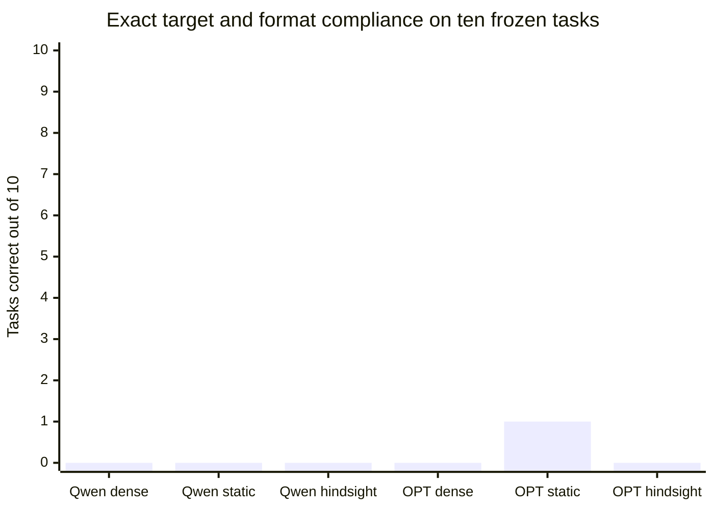

# v0.10.0 - Both dense baselines score zero on the fixed exact-output tasks

Both dense baselines score **0/10** under the frozen plain-text, whole-output exact
answer rule. OPT static selection scores 1/10; every other masked condition scores 0/10.
This task endpoint cannot demonstrate preservation of useful agent behavior with
these weak dense baselines. The records include formatting failures and substantively
wrong answers, not only a strict parser penalty. No first-line rescoring or prompt
repair follows from this outcome.

This prerelease completes the separately authored ten-task control: **two tasks each
for code, data extraction, arithmetic, exact copying and topic changes**, as requested
for the intended agent. The frozen Qwen2.5-1.5B-Instruct and OPT-1.3B checkpoints are
compared with their own dense outputs using their earlier calibration-only popularity
layouts. No task is replaced, refitted or accepted manually after scoring.

| Model / condition | Exact targets | Answer relative PPL | Answer KL | Full-text relative PPL | Selected FFN volume |
|---|---:|---:|---:|---:|---:|
| qwen dense | 0/10 | 1 (reference) | 0 (reference) | 1 (reference) | 100% |
| qwen static | 0/10 | 1.913061 | 0.467378 | 1.434928 | 90.000000% |
| qwen hindsight | 0/10 | 1.019995 | 0.060952 | 1.031498 | 90.000000% |
| opt dense | 0/10 | 1 (reference) | 0 (reference) | 1 (reference) | 100% |
| opt static | 1/10 | 1.041058 | 0.168180 | 1.677362 | 90.039670% |
| opt hindsight | 0/10 | 0.999999 | 0.000000 | 1.000000 | 90.039670% |

Exact targets require the entire decoded text before tokenizer EOS, stripped only of
surrounding whitespace, to equal the frozen answer. Additional output is wrong. All
32 greedy generated IDs, including EOS and subsequent IDs, remain in the ledger.
Answer-only PPL predicts the answer starting at the last prompt token; full-text PPL
also includes the prompt. These denominators answer different questions. Absolute
PPL is not compared across tokenizers, and literal code answers are not execution tests.

Model completion states are **qwen: completed** and
**opt: completed**. The archive contains 138 raw rows, and
72/72 local/full-layout numerical controls pass.
The control reports every per-task output and metric; a model's poor dense baseline
must remain visible when interpreting changes under omission. Ten fixtures provide
only a bounded development observation, not general agent or held-out task accuracy.
Topic-change fixtures switch instructions within a prompt; KV resets between tasks.
This does not test persistent execution state, cross-task residency or long conversations.

Hindsight uses current dense activations and is privileged. These bars do not nominate
a causal policy or establish improved general capability.

## What the omission measurements establish

Qwen static retention raises answer perplexity by 91.306%, while hindsight raises it
by 2.000%. Qwen hindsight agrees with dense top-1 predictions on all 42 teacher-forced
answer tokens, yet only 1/10 complete generated continuations matches dense; mean
agreement across its 32 generated tokens is 37.188%. Teacher-forced answer agreement
therefore does not establish matching closed-loop output on these prompts.

OPT hindsight preserves answer/full-text probabilities to numerical tolerance and
all 10 generated continuations exactly. Its static mask raises answer perplexity by
4.106% and full-text perplexity by 67.736%. The single exact static answer is the
copy-case identifier; one success against a zero-success dense baseline does not
establish improved general capability. The answer-token denominators are 42 for Qwen
and 34 for OPT, each within its own tokenizer; domains still have two tasks each.

The no-chat-template plain-text format and exact-output requirement are material
limitations of this frozen control. For example, Qwen emits an incorrect 11 for the
code-output task and adds unrelated text after 391 on multiplication. Before using
a task endpoint as a utility gate, a separate prospective experiment needs a viable
dense baseline and a predeclared instruction format on fresh tasks. This release
neither changes those prompts nor reinterprets the failed exact-match criterion.

## What was frozen and retained

The protocol, source, corpus and scorer were committed and pushed as
[5998036](https://github.com/displague/dynamic-model-loading/commit/59980363c2a5445242a2ab0f4e41e2bdd72fab5a) before either pretrained model saw these tasks.
The original Python 3.14.3 / torch 2.10.0+cu130 / Transformers 5.13.1 FP32 CUDA environment
was used with TF32 disabled and four CPU threads. GPU model runs were serialized.
The identical plain-text instruction is used without a chat template or added special
tokens. That format, instruction tuning, model size/training and tokenizer differences
are explicit confounds; this comparison cannot isolate an architectural effect.

Both models use their pretrained attention, normalization and residual paths with
actual one-token KV execution. Local width 8 reconstruction and full teacher-forced
layout checks precede masked conditions; layout generations must exactly equal native
dense IDs. Static selection keeps the first calibration-sorted groups; hindsight ranks
current contribution-norm scores with stable group-index ties. Nominal 90% retention
means 1008/1120 groups for Qwen and 922/1024 for OPT. OPT input biases move with groups;
output biases are charged on every visit. Selected parameter volume is not transferred
bytes or achieved memory use: the apparatus retains full weights and restoration copies.

All native/layout/masked logits, mask traces and generations are retained. Each
finite generated path is checked independently from teacher forcing. Nonfinite tensors,
invalid metric receipts and complete failure grids are preserved; invalid numerical
outputs never become valid accuracy evidence through apparently sensible token IDs.
Reconstruction metrics use their exact saved CPU tensors, avoiding GPU/CPU reduction
mismatches without relaxing the original numerical thresholds.

Independent analysis verifies committed source/configuration/protocol blobs, frozen
corpus and tokenization boundaries, pinned checkpoint/parent catalogs, all saved-logit
metrics, generated text and scoring, complete mask/observation grids, bias accounting,
and every global/domain aggregate. Restoring the release assets must reproduce analysis
exactly without pretrained rescoring. The prospective apparatus passed 171 CPU tests in
both available PyTorch environments; the integrated release suite adds the hardware
fixtures for 182 tests, with clean-tip verification retained in the publication receipt.

This closes bounded [#20](https://github.com/displague/dynamic-model-loading/issues/20), while held-out quality [#8](https://github.com/displague/dynamic-model-loading/issues/8)
and broader model generalization [#13](https://github.com/displague/dynamic-model-loading/issues/13) remain open. The next decisive
question is still whether causally available partial execution evidence can request
economical repair. [#19](https://github.com/displague/dynamic-model-loading/issues/19) covers current input, observed history,
residency and charged probes/abstention; physical paging and refinement runtime remain
gated on the **complete causal policy**. No runtime, memory saving or speedup is claimed.

[Complete task and domain results](https://github.com/displague/dynamic-model-loading/blob/v0.10.0/docs/balanced-development-results.md),
[all generated continuations](https://github.com/displague/dynamic-model-loading/blob/v0.10.0/docs/balanced-development-generations.md),
[prospective protocol](https://github.com/displague/dynamic-model-loading/blob/v0.10.0/docs/balanced-development-protocol.md),
[archive and restoration](https://github.com/displague/dynamic-model-loading/tree/v0.10.0/results/balanced-control-20260911).
