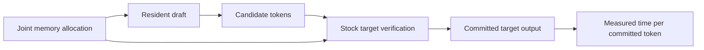

# v0.13.0 - Move to target-verified speculation and prepare the stock comparison

The project retires its tested Qwen2.5-1.5B FP32 grouped per-token execution and
local-repair implementation as the primary engineering path. The next question is
whether resident drafting can amortize an offloaded target's execution, after
charging draft computation, state and the target residency it displaces.

This release completes the architectural decision, planning transition and pinned
stock-runtime preparation. **It contains no target-scale inference measurements,
acceptance results or speculative speedup claims.** The benchmark remains open.
Its prospective protocol and authored workloads are recorded; the measurement
harness and complete execution preregistration must be committed before inference.

## Why the execution boundary changes

The preserved experiments form the decision record:

| Release | Established observation | Consequence for this implementation |
|---|---|---|
| v0.2 | Hindsight neuron omission retains much more quality than the tested physical groups. | Useful contribution sparsity did not become an equally useful grouped working set. |
| v0.4 | A protected hot set saves simulated traffic; tested LRU misses every access. | Reuse distance and scheduling matter; zero hits do not establish absence of locality. |
| v0.7 | Four tested causal selectors fail the frozen quality screen. | The simple predictor class supplies no runtime nominee. |
| v0.8 | Privileged repair finds narrow headroom. | A causal own-trajectory test was justified, not a production pager. |
| v0.9 | Gathering, staging and dispatch materially affect acquisition price. | Bytes alone do not predict latency. |
| v0.12 | Partial evidence improves matched aggregate quality, but no policy meets both quality and economics. | Further tuning has lower priority than a different execution boundary. |

At 92.5% retention, v0.12 partial evidence reaches relative PPL **1.089487** versus
**1.112546** for its matched larger one-shot control. All four partial-evidence
prefixes fail quality. Its detector requests dense completion on **96.610%** of
layer visits while retaining negative simulated warm savings. This is evidence
against that local-error detector and calibration regime, not every omission
detector. Different masks, prefixes and memory accounting prevent describing the
v0.8/v0.12 difference as a matched fraction of available repair recovered.

The v0.12 reconstructed timing advantage is confounded by batch partitioning:
full completion itself benefits relative to the declared dense schedule. Preserve
the primitive observations, but do not carry those reconstructed model-time
estimates into speculative runtime economics. No historical tolerance or result is
rewritten. PowerInfer and other prior art inform the decision without supplying a
performance ceiling, laptop prediction or novelty claim.

## Concrete next comparison

[ADR 0003](https://github.com/displague/dynamic-model-loading/blob/v0.13.0/docs/adr/0003-verified-speculation-boundary.md)
sets a fixed **Qwen2.5-32B-Instruct Q4_K_M** target. Its five official pinned GGUF
shards total **19,851,336,384 bytes**, exceeding the GPU's reported capacity before
runtime state. The catalogue also pins official Qwen 0.5B and 1.5B Q8_0 drafts and
one bartowski IQ2_XS 32B non-sharing compressed-draft control. Together these model
artifacts require **32,379,130,304 bytes** of disk storage, before the runtime and
measurement receipts. File sizes are not runtime allocations.

The official Windows x64 CUDA 13.3 **llama.cpp b10919** binaries and runtime DLLs
were downloaded and hash-verified against their release digests. Version output
identifies commit **d3146f2b56c2db4711ac8391871c9e529d1946d7**. The matching source
was inspected; stock device enumeration recognizes the RTX 5080 Laptop GPU. The
binary help confirms the current `--spec-draft-n-max` controls and removal of
`--draft-max`. Source inspection identifies `LLAMA_TRACE` verification events for
accepted-prefix receipts; this is not validation of telemetry on a running model.

The [prospective protocol](https://github.com/displague/dynamic-model-loading/blob/v0.13.0/docs/stock-speculation-protocol.md)
compares best measured target-only placement, 0.5B/1.5B drafts at maximum lengths
4/8/16, a feasible non-sharing low-bit target draft, and placement-matched
target-only controls. Placement and CPU-thread calibration are separate from
evaluation. Every candidate charges its actual memory competition under a common
15,000 MiB device-used limit and a 2 GiB host-available floor. This finite search
does not establish a global configuration optimum.

Six authored sustained code/prose/data prompts complement the twenty historical
balanced scalar smoke fixtures. A 4,096-token context is a capacity setting; actual
input/output lengths, EOS, discarded drafting and committed tokens remain visible.
Repeated orders, fixed greedy decoding and compact raw receipts support paired
comparison. A stable target-only reference remains authoritative; divergent IDs
require common-prefix investigation, not a revised reference. The historical
1.5B Gate A does not gate the new runtime study.

## Planning, validation and present limitation

Issues #11 and #16 are retired as **not planned under the superseded design**.
Old-scope #19 retains its title and history and is also closed as not planned.
Their closure is neither implementation completion nor a disproved hypothesis.
The completed v0.12 issue #22 remains completed. A new milestone tracks
[stock benchmarking #23](https://github.com/displague/dynamic-model-loading/issues/23),
[measured cycle/resource analysis #24](https://github.com/displague/dynamic-model-loading/issues/24),
[optional representations #25](https://github.com/displague/dynamic-model-loading/issues/25) and
[adaptive control #26](https://github.com/displague/dynamic-model-loading/issues/26).
Old runtime milestones are closed as not pursued;
other unresolved research questions are deferred. The updated roadmap labels the
earlier dependency ladder as historical.

The code review found no actionable defects in the scoped decision, protocol,
catalogue, workloads and planning changes. Preparation validates release asset and
executable hashes, pinned source identity, CLI controls and device enumeration.
Publication requires the complete existing CPU suite on the final clean candidate
in both recorded PyTorch environments. These checks do not establish benchmark
readiness or reproduce target inference.

**Storage currently blocks model acquisition.** Only about 8.4 GB remained free
after stock-runtime preparation and lossless compression of a restoration copy.
The target alone needs 19.85 GB. Automatic approval review rejected deletion of two
redundant restoration directories; neither was deleted. Compression preserved all
contents and recovered about 2.1 GB, which did not resolve the shortage. Original
measurements and published archives remain intact. No target model was downloaded
or run during this delivery. Additional storage is needed to execute the protocol.

The next action is the stock target-scale comparison once storage is available.
Measured results determine whether to keep an existing small draft, study another
representation or change scheduling/state management. This release does not
authorize a custom shared-resident runtime by itself.

[Updated roadmap](https://github.com/displague/dynamic-model-loading/blob/v0.13.0/docs/plan.md) ·
[Artifact catalogue](https://github.com/displague/dynamic-model-loading/blob/v0.13.0/configs/stock-speculation-artifacts.json) ·
[Workloads](https://github.com/displague/dynamic-model-loading/blob/v0.13.0/data/stock-speculation-workloads.json) ·
[Preparation receipts](https://github.com/displague/dynamic-model-loading/tree/v0.13.0/results/stock-speculation-preparation)
