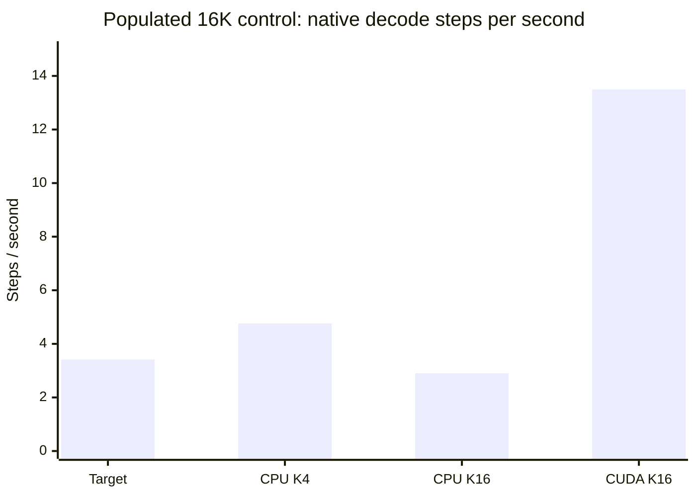

# v0.15.0 - Stock CUDA verification improves throughput; prefix construction explains selected reversals

Lowering stock llama.cpp's **`GGML_OP_OFFLOAD_MIN_BATCH` from 32 to 8** raises
short-context K16 throughput from **11.681 to 19.739 emitted tokens/request s**.
Compared with the newly repeated default-threshold K4 winner at **17.659**, the
gain is **11.8%**. The proposed 25-token/s forecast is **not reached**. This uses
the unchanged b10919 binary, the existing Qwen2.5-32B-Instruct Q4_K_M target and
a resident Qwen2.5-0.5B-Instruct Q8_0 draft. No runtime patch was necessary.

Backend assignments and actual CUDA copies confirm the proposed mechanism.
The bounded target-only numerical diagnostic also reproduces all four selected
historical rebuild reversals through prefix construction. **Independent
speculative KV/mask correctness remains open**, and cross-path generated-ID
identity is not claimed. The old v0.14 failures remain unchanged.

## The stock short-context comparison

| Condition | Emitted/request s | Emitted/native decode s | Native decode steps/s | Mean prefill s/request | Mean native decode s/request |
| --- | --- | --- | --- | --- | --- |
| cpu-k4 | 17.6585 | 18.3544 | 18.2827 | 0.541 | 13.948 |
| cpu-k8 | 16.3155 | 16.8801 | 16.8141 | 0.517 | 15.166 |
| cpu-k16 | 11.6805 | 11.8697 | 11.8234 | 0.342 | 21.567 |
| offload-k8 | 19.0336 | 19.6160 | 19.5394 | 0.393 | 13.051 |
| offload-k16 | 19.7385 | 20.5345 | 20.4543 | 0.493 | 12.467 |
| disabled-k16 | 11.3563 | 12.1670 | 12.1195 | 1.495 | 21.041 |

Each row totals twelve requests over six frozen sustained prompts and two
configuration orders, generating 3,072 tokens. Target placement and threads
stay fixed: 44 GPU layers including output, or 43 GPU/21 CPU transformer layers;
target threads 24/24 and draft threads 8/24. Actual prompts are 73–103 tokens,
context capacity 4096, both KV caches f16. Every continuation reaches the original
256-token cap with EOS enabled. Within each configuration, both repeats generate
the same IDs; outputs can differ between configurations and from the fixed target.

Request rate includes prefill, discarded proposals, verification and coordination
inside the completion interval. Native decode timing excludes the first emitted
token; the detailed tables retain both emitted/native-decode and native decode-step
rates. Startup, model hashing and separate tokenization are outside request time.
Two repeats are a bounded local comparison, not a confidence interval or broad
workload guarantee. Disabling operation offload changes prefill as well as decode.

## CUDA actually receives the cold-weight operations

At the first 17-position target verification graph, all **21 cold-layer FFN up
projections** move from CPU to CUDA at threshold 8. The disabled-offload control
returns all 21 to CPU. Graph assignments establish placement, not physical bytes.

Separate Nsight captures supply those bytes. During the same 32-token code-cache
request, total captured H2D is **6.242 GB at threshold 32 and 24.997 GB at threshold
8**. The large tensor-copy pattern repeats four times versus once: for example,
79,626,240-byte copies occur 204 versus 51 times. Both requests record six
acceptance events, 60 attempted draft tokens and 25 accepted tokens. The small
tail batches do not all follow maximum K's backend path.

These windows include prefill, drafting and verification, with startup excluded.
They demonstrate repeated tensor movement, not an isolated verification timer,
one contiguous layer copy or critical-path transfer stalls. Summed CUDA durations
can overlap. Profiler and verbose runs never enter the throughput table.

The first capture exported real CUDA activities but failed a post-shutdown
owned-process exit check and lacked forwarded native logs. It remains a failed
attempt with partial evidence. A committed prospective correction used stock
`--log-file` and bounded owned-process cleanup; both fresh corrected captures
completed. No successful timing row or original capture was overwritten.

## Populated 16K context

The gain survives the populated cache: threshold8/K16 reaches **13.60 emitted
tokens/native decode s**, versus **4.80** for default K4. Charging the roughly
33-second prefill yields **3.003 versus 2.112 emitted tokens/request s**, a
**42.1%** gain. All **16 scored long requests** match the two placement-matched
target-only references exactly, across both repeats. This observed agreement
does not replace the separate independent speculative-state obligation.

| Condition | Emitted/request s | Emitted/native decode s | Native decode steps/s | Mean prefill s/request | Mean native decode s/request |
| --- | --- | --- | --- | --- | --- |
| target | 1.8018 | 3.4409 | 3.4140 | 33.824 | 37.200 |
| cpu-k4 | 2.1123 | 4.8013 | 4.7638 | 33.927 | 26.660 |
| cpu-k16 | 1.6546 | 2.9246 | 2.9018 | 33.583 | 43.766 |
| offload-k16 | 3.0026 | 13.6047 | 13.4984 | 33.201 | 9.409 |

This control uses exactly **16,384 input tokens**, 18,432 capacity, 128 output
tokens, q8_0 target/draft KV and 38 target GPU layers including output (37 GPU/27
CPU transformer layers). All conditions reuse two tokenized prompts frozen before
generation, with synthetic engineering records between the chat header and intact
final instruction. The target-only control uses the same long-context placement;
it is not an optimized long-context target-only allocation search. This is a
populated-cache sensitivity test, not evidence of useful 16K reasoning or agent
quality. Prefill and decode are reported separately because long prefill dominates
these short output requests.

The chart uses native decode steps, excluding the first emitted token. It describes
this fixed-placement control rather than an optimized allocation for every model.

## What the numerical diagnostic resolves

Five target-only paths evaluate eight frozen prefixes: four historical rebuild
mismatches and four ordinary position-32 controls. All **1,447 diagnostic requests**
and **40 full-vocabulary probability responses** are retained. Every incremental
extension reuses the expected prefix cache and evaluates exactly one supplied token.
All 40 final outputs equal their returned probability argmax.

| Target-only factor | Requests | Final historical matches | All historical matches | Unique supplied-prefix matches |
| --- | --- | --- | --- | --- |
| prefill | 8 | 4/8 | 4/8 | 4/8 |
| microbatch | 8 | 6/8 | 6/8 | 6/8 |
| incremental-reference | 477 | 8/8 | 477/477 | 358/358 |
| threads | 477 | 8/8 | 477/477 | 358/358 |
| placement | 477 | 7/8 | 473/477 | 355/358 |

The 16-to-24 decode-thread comparison produces identical probability vectors at
all eight final positions. Changing one layer's placement flips one selected
case. Full-prefix construction flips all four selected cases relative to the
incremental reference, with no flips at the four ordinary controls. The API
returns serialized log-softmax rather than raw logits; probability distances,
top-two gaps and their limitations are explicit in the detailed record.

This narrows the historical numerical explanation without proving that all
speculative state is correct. The stock speculative probability-return path has
a TODO; counters and intended acceptance source code cannot independently verify
every accepted token's target KV, positions and mask. Neither a universal near-tie
explanation nor a population flip rate follows from the selected eight positions.

## Receipts and resulting priority

Protocols and executable harnesses were pushed before their measurements:
[timing/mechanism protocol](https://github.com/displague/dynamic-model-loading/commit/3f44ac2),
[diagnostic supplement](https://github.com/displague/dynamic-model-loading/commit/f884517),
and [profiler apparatus correction](https://github.com/displague/dynamic-model-loading/commit/f4621be).
All runs retain process environment, model/runtime hashes, HTTP bytes, generated
IDs, canonical acceptance events, allocation logs and sampled resource traces.

All **23 main groups / 114 requests** complete with passing sampled bounds:
15,000 MiB total device-used maximum and 2 GiB host-available minimum. The main
matrix's observed peak is 14,721.12 MiB, with 8.787 GiB minimum host available.
Sampling is not proof against short peaks, eviction or storage traffic. Including
numerical diagnostics and profiler attempts gives 31 processes and 1,567 inference
requests; the first profiler attempt remains failed.

The **229.6 MB raw archive** contains **9,617 files**, all independently extracted
and verified against original hashes. All five analyses reproduce byte for byte
from the restoration. The complete **250-test** fixture suite is required on the
final clean candidate in both recorded PyTorch environments; the actual final-tip
receipts, completed review clearance and publication validation are release assets.
No pretrained experiment is rescored for publication.

This completes bounded [#28](https://github.com/displague/dynamic-model-loading/issues/28).
[Fidelity #27](https://github.com/displague/dynamic-model-loading/issues/27) and
the stock milestone remain open for independent speculative-state validation.
[Representation #25](https://github.com/displague/dynamic-model-loading/issues/25)
stays deferred; [adaptive control #26](https://github.com/displague/dynamic-model-loading/issues/26)
remains optional and should charge the complete cost of draft length and backend
at the intended context. No flat-verification assumption, universal stopping
threshold, custom pager or shared-resident runtime is adopted.

[Complete findings and reproduction](https://github.com/displague/dynamic-model-loading/blob/v0.15.0/docs/verification-offload-results.md),
[all conditions, requests and numerical comparisons](https://github.com/displague/dynamic-model-loading/tree/v0.15.0/results/verification-offload-20260913),
[research plan](https://github.com/displague/dynamic-model-loading/blob/v0.15.0/docs/plan.md),
[ADR 0003](https://github.com/displague/dynamic-model-loading/blob/v0.15.0/docs/adr/0003-verified-speculation-boundary.md).
