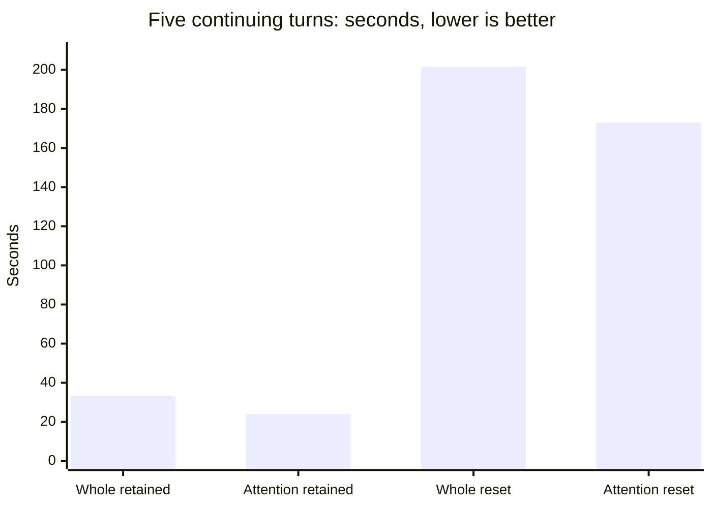

# Resident attention keeps five continuing turns at 23.98 seconds

The stock attention-resident / 32-host-FFN layout preserves the prefix-reuse
benefit on the original continuing-conversation fixture. Five retained turns take
**23.985 seconds**, versus **33.110 seconds** for a fresh whole-layer control;
mean token-bearing TTFT is **0.623 versus 0.776 seconds**. Both use threshold2,
K16/p_min0 and the original 128/64-token output caps.

This is a **38.0% increase in emitted/request throughput**, with 27.6% less
five-turn time. Conversation histories differ after extraction, so it is not an
identical-input acceleration claim across every turn. Four of five retained
answers hit64 tokens. The result measures fixture latency, not task completion.

## Measurements

| Layout / mode | Five continuing turns | Mean token TTFT | Emitted/request second |
|---|---:|---:|---:|
| Whole retained |33.110 s|0.776 s|8.608|
| Attention retained |23.985 s|0.623 s|11.883|
| Whole reset |201.514 s|34.601 s|1.414|
| Attention reset |172.973 s|30.569 s|1.625|

Eight fresh processes, two reversed layout repeats,48 scored requests and 8
excluded warmups completed without failed attempts or replacement runs. Each
reset uses its retained pair's exact prompts; all 24 resets report zero reuse.
Attention retained repeats take 23.993 s and 23.977 s. Initial cold requests remain
34.574 s on attention and 40.596 s on whole placement. The same-input, same-output
code turn takes 4.504 s versus 6.153 s; extraction outputs then diverge.

All 24 within-layout/mode repeat output pairs match. Across layouts, retained
prompts agree on 6/12 requests and outputs on 6/12. Retained/reset outputs agree
on 8/12 whole and 10/12 attention requests. No disagreement is waived and no new
independent replay is claimed. The earlier nine short discrepancies keep
[#27](https://github.com/displague/dynamic-model-loading/issues/27) open.

## Configuration and limits

Unchanged b10919, Qwen2.5-32B-Instruct Q4_K_M target and 0.5B-Instruct Q8_0 draft,
RTX 5080 Laptop 16GB / Ultra 9 275HX, driver 616.92. Candidate `-ngl 65` and
`--n-cpu-ffn 32`; control38 GPU layers including output. Both use q8_0 target/draft
KV,18432 capacity with 16384 initial positions, flash attention on, batch/ubatch256,
target threads 24/24 and draft 8/24. No model or runtime patch.

Actual CUDA_Host buffers and exact KV allocations pass every startup. Target KV
is 2448 MiB entirely CUDA in the candidate. Sampled peaks are 14447.10 MiB attention
and 13759.10 MiB whole, under the **15000 MiB** allowance. This is a specified-layout
comparison, not a globally optimized allocation frontier or an isolated attention timer.

Draft prompt forwarding is source-derived, not an independent draft reuse counter.
In-process retention is measured. Pinned slot disk handlers save/load target
`ctx_tgt` only; complete target/draft restoration across restart remains unqualified.
No 32K, larger output-cap, draft, controller, overlap or pager extension is included.

## Reproduction and disposition

The [protocol and harness](https://github.com/displague/dynamic-model-loading/blob/5b7dcbd8ace3357b263536f0a38b88badfec1050/docs/attention-agent-protocol.md)
were reviewed and pushed before inference. The raw ZIP contains 1418 inventoried
files (32621641 uncompressed bytes); every member was restored and hashed, and
model-free analysis reproduced byte-identically. Archive SHA 256:
`1a297d72a74eb253f4c6bbf66dec5d67786caf333cbd0a2be84968ff43a9bd21`.
Publication requires independent final review and 277 full-suite checks on the
clean final candidate in both torch 2.10.0+cu130 and 2.12.0+cu130 environments.
Python orchestrates; stock native CUDA executes model inference.

This completes [#31](https://github.com/displague/dynamic-model-loading/issues/31).
The broader milestone stays open; #25/#26 remain deferred. The bounded optimization
queue stops here. Use the measured configuration with its output and workload limits.

- [Detailed findings](https://github.com/displague/dynamic-model-loading/blob/v0.18.0/docs/attention-agent-results.md)
- [Per-turn timing, agreement and acceptance](https://github.com/displague/dynamic-model-loading/blob/v0.18.0/docs/attention-agent-tables.md)
- [Configuration guide and persistence boundary](https://github.com/displague/dynamic-model-loading/blob/v0.18.0/docs/stock-long-context-configuration.md)
- [Compact receipts and restoration](https://github.com/displague/dynamic-model-loading/tree/v0.18.0/results/attention-agent-20260913)
- [Research plan](https://github.com/displague/dynamic-model-loading/blob/v0.18.0/docs/plan.md)
