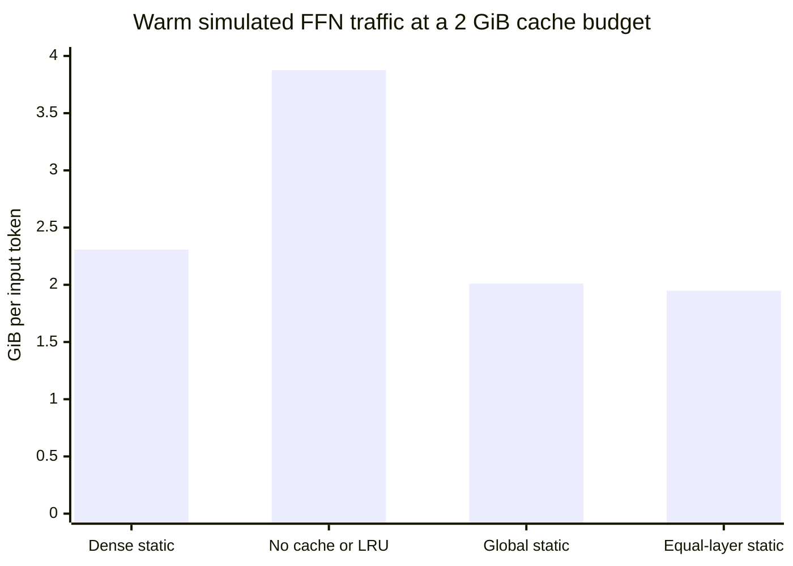

# v0.4.0 - A narrow grouped frontier after cache accounting

This research prerelease completes the original Stage 2 cache-trace experiment.
Exactly one of 72 selection conditions passes the prospective development screen:
**popularity packing, 8-neuron groups, 90% retention**. Its relative perplexity is
**1.008978**, KL is **0.015765**, and top-1 agreement is **94.31%**. With a 2 GiB cache
split evenly across layers, simulated warm traffic is **15.54% lower** than the
strongest same-budget dense static baseline. The frozen selection rule nominates
this condition for a causal-predictor experiment.

This is a narrow result on reused development data. Nine of 16 articles individually
exceed 1% PPL increase, with a document range of 0.985415–1.028098. Both static policies
pass at all four budgets: eight passing traffic rows represent one quality condition,
not eight independent quality successes. No other layout/width/retention combination
passes. Held-out and task equivalence remain unmeasured.

The chart compares the nominated condition's cache policies with the strongest dense
static baseline; lower is better. The full grid and a labeled quality zoom are in the
[standalone figure](https://github.com/displague/dynamic-model-loading/blob/v0.4.0/results/cache-trace-20260911/figures/cache-frontier.png).
All traffic is simulated. No PCIe transfer, reduced residency, or inference speedup
was measured.

The protocol and apparatus were pushed as `e607865` before measurement. The study
preserves the Qwen2.5-1.5B-Instruct checkpoint, FP32 / torch 2.10.0+cu130 environment,
80 calibration articles, 16 WikiText development articles, exact tokens, and layouts
from the earlier pilot. All 112 local reconstruction and 64 full-layout checks pass
the original numerical limits; maximum relative logit L2 is 2.174e-6. All 256
overlapping per-document pilot rows reproduce exactly.

The grid covers native, random, popularity, and co-activation layouts; group widths
8/32/128; and retention 50/75/85/90/95/99%. It records the exact applied mask alongside
each of 1,152 document-quality rows, then replays four policies at 256/512 MiB and
1/2 GiB in cold and warm states. The archive preserves 36,864 document replay rows
and 2,304 aggregate rows, including every failure and boundary control.

LRU has zero hits throughout the grid: between consecutive layer visits, distinct
other-layer requests exceed retained capacity even at minimum retention and maximum
budget. Independent review checked the sufficient bound against 28,672 explicit
synthetic replays. Static caches preload hot pages on cold documents, charging unused
pages too; warm replay retains them. The nominated width-8 cache has 14,562 retained
slots plus a 144 KiB incoming slot inside the 2 GiB budget. Fixed non-FFN parameters
add 1,550,637,056 bytes; KV, workspaces, and host staging remain unmeasured.

The selected groups cover 91.14% of the top individual-neuron choices. Covering all
those neurons with physical groups would amplify their individual volume by 1.111110,
almost fetching the whole FFN. This is a separate geometric diagnostic, not a
quality-evaluated cover mask or measured traffic. Width-128/99% retention rounds to
all groups and is explicitly retained as a no-omission boundary control.

Review corrected a too-narrow dense comparator, incomplete numerical-gate validation,
and division by zero for a fully resident dense baseline. The pre-measurement suite
passed 53 tests; the current suite passes 59 in both the baseline and separately
prepared PyTorch 2.12 environment. That environment's arithmetic control has its own
protocol and delivery; these trace results continue to use torch 2.10. Figure v2
changes only presentation of the quality detail and preserves the plotting source.

The `cache-traces-v0.4.0.zip` asset contains all 1,152 packed masks (290,741,226 bytes;
SHA256 `37e53063c55b6f7e7e6b2896c52ddbdee190b50c3bd5a9699df2e11022c8c614`).
Hashes, raw quality, complete replay receipts, exact source, and reproduction
instructions remain in the repository. The old apparatus report's no-cache-simulator
boilerplate is superseded by the separate analysis archive; original receipts remain
unchanged.

This closes issue #9. The next dependent step is causal prediction at the nominated
condition, with pre-FFN feature availability, predictor cost, independent omission
audits, and approximate closed-loop evaluation. Multi-domain held-out quality, actual
bounded RAM-to-VRAM execution, practical BF16 grouping, and corrective refinement
remain open. Token-major replay of teacher-forced prefill masks is not incremental
decode or a runtime result.

Evidence: [protocol](https://github.com/displague/dynamic-model-loading/blob/e607865/docs/cache-trace-protocol.md),
[findings](https://github.com/displague/dynamic-model-loading/blob/v0.4.0/docs/cache-trace-results.md),
[indexed archive](https://github.com/displague/dynamic-model-loading/tree/v0.4.0/results/cache-trace-20260911),
[completed issue](https://github.com/displague/dynamic-model-loading/issues/9),
[causal prediction](https://github.com/displague/dynamic-model-loading/issues/10),
[research plan](https://github.com/displague/dynamic-model-loading/blob/v0.4.0/docs/plan.md).
