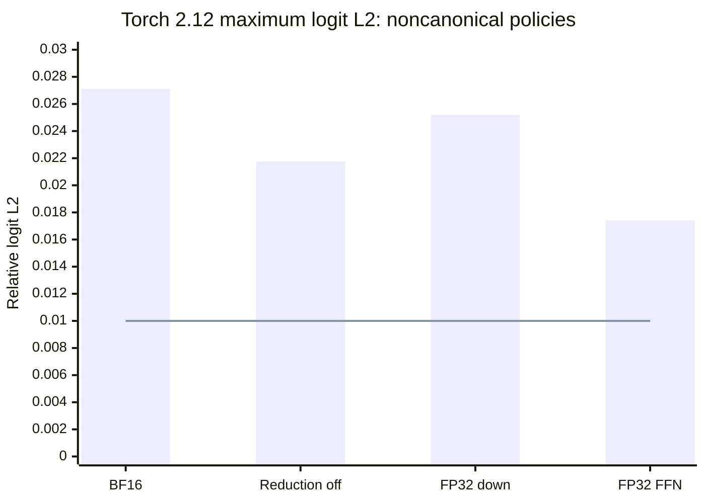

# v0.5.0 - PyTorch 2.12 preserves the BF16 packing failure

This research prerelease completes the separate environment control from the original
Stage 0 plan. **PyTorch 2.12.0+cu130 does not resolve the BF16 permutation failure.**
Ordinary BF16, disabled reduced-precision reduction, FP32 down, and FP32 FFN policies
still fail the original numerical limits. Canonical down-projection order is exactly
equal to ordinary native BF16 within each environment, while retaining its costly
inverse-gather implementation. No practical sparse execution or speedup is established.

The torch 2.10 repeat reproduces all **60 archived rows exactly**. Both new runs use
the same Python 3.14.3 interpreter, pinned Qwen2.5-1.5B-Instruct weights, six original
smoke documents, token IDs, permutations, Transformers 5.13.1, SDPA, CPU threads,
and precision settings. The protocol and apparatus were pushed as `fe1dd44` before
measurement. These are numerical controls, not a new task-quality benchmark.

| Repacked versus policy-native output | 2.10 maximum L2 | 2.12 maximum L2 | Original limit |
|---|---:|---:|---:|
| Ordinary BF16 | 0.029594 | 0.027114 | 0.01 |
| Reduction disabled | 0.020588 | 0.021761 | 0.01 |
| FP32 down | 0.019678 | 0.025195 | 0.01 |
| FP32 FFN | 0.020914 | 0.017395 | 0.01 |
| Canonical down order | 0 | 0 | 0.01 |

Bars are the worst document L2 under the four noncanonical policies; the line is the
original limit. Canonical down order is exactly zero, as recorded in the table.
The four failing policies also exceed the 0.001 KL limit, with maximum KL under
2.12 of 0.001511, 0.001368, 0.001320, and 0.001273 respectively. Full per-document
results and policy-versus-ordinary-BF16 comparisons remain in the raw ledger.

Ordinary native BF16 outputs differ across environments even with identical weights
and tokens. Across the six documents, relative logit L2 is 0.015831–0.024369 and
KL is 0.001018–0.001567; all six exceed the original numerical limits. Top-1 agreement
is 95.51–98.78%, while relative PPL is 0.992949–1.008763. This describes environmental
drift, not which output is closer to external truth. The original baseline remains
in place; no environment's measurements are silently pooled with the other's.

The isolated 2.12 environment initially passed CUDA execution but failed model imports
because shared torchvision 0.25.0 was binary-incompatible. Installing torchvision
0.27.0 resolved it. After aligning all other effective package versions, the complete
inventory differs only in torch and torchvision: 2.10.0/0.25.0 versus 2.12.0/0.27.0,
all CUDA 13.0 builds. This is an explicitly documented environment pair, not an
unqualified torch-only attribution. The initial failure has an operator receipt;
the complete original terminal transcript was not archived.
Optional shared torchaudio remains 2.10.0 and declares a torch-2.10 dependency; audio
is outside the evaluated text-model path. The project's direct requirements and
those of torch, torchvision, Transformers, and safetensors are satisfied. This is
not validation of every optional package in the shared environment.

Both environments pass the full **59-test suite**. Review corrected missing invariant
settings checks, dense logits that were not bound to their producing run, and lost
failures before output-directory creation. The final implementation reserves exclusive
run directories before preflight, verifies pinned inputs and the full inventory,
requires original numerical limits and anchored historical configuration, and rejects
swapped logits through embedded manifest provenance. All 60 comparisons per environment,
policy aggregates, source equality, and exact historical reproduction were validated.
Follow-up review found no actionable regressions.

The repository preserves complete raw receipts, inventories, source snapshots, and
lossless layout archives. The separately hashed `torch-logits-v0.5.0.zip` release
asset contains both ordinary dense-logit bundles as lossless gzip payloads; its exact
size, file hashes, and restoration instructions are recorded in the archive. Existing
experimental receipts and the baseline environment remain unchanged.

This closes issue #5. Practical BF16 grouping remains issue #4. The ReLU positive
control and causal prediction at v0.4's nominated grouped condition are the next
independent experiments. Multi-domain held-out quality, actual bounded transfers,
and corrective refinement remain open.

Evidence: [protocol](https://github.com/displague/dynamic-model-loading/blob/fe1dd44/docs/torch212-protocol.md),
[complete findings](https://github.com/displague/dynamic-model-loading/blob/v0.5.0/docs/torch212-results.md),
[indexed archive](https://github.com/displague/dynamic-model-loading/tree/v0.5.0/results/torch-control-20260911),
[completed issue](https://github.com/displague/dynamic-model-loading/issues/5),
[practical BF16 policy](https://github.com/displague/dynamic-model-loading/issues/4),
[research plan](https://github.com/displague/dynamic-model-loading/blob/v0.5.0/docs/plan.md).
