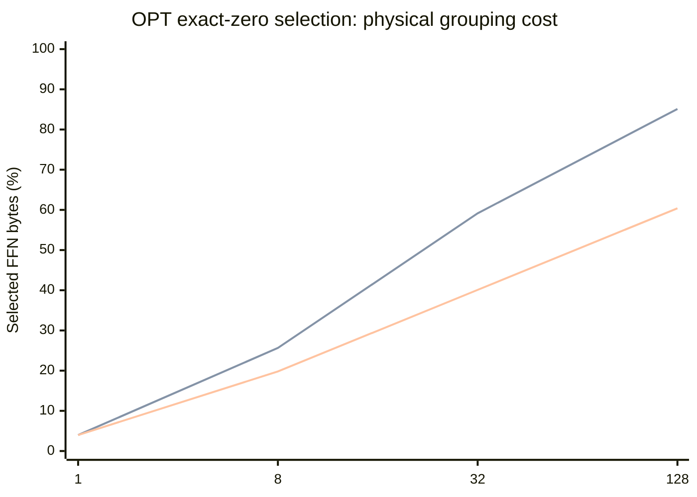

# v0.6.0 - ReLU sparsity survives the control but shrinks under grouping

This research prerelease completes the original plan's **OPT-1.3B ReLU positive
control**. About **96.04% of neuron activations are exactly zero** on the development
slice. Selecting every physical group with any nonzero activation passes the original
numerical gates. Popularity packing preserves more of this opportunity than native
or random order, but wider groups still consume substantially more selected volume.

| Exact-zero selection | Width 1 | Width 8 | Width 32 | Width 128 |
|---|---:|---:|---:|---:|
| Native: selected FFN bytes | 3.97% | 25.62% | 59.15% | 85.04% |
| Random: selected FFN bytes | 3.97% | 25.65% | 59.15% | 85.13% |
| Popularity: selected FFN bytes | 3.97% | 19.80% | 40.10% | 60.40% |

The lines follow the table order: native, random, popularity. Native and random
nearly overlap. The x-axis is group width; these are hypothetical selected bytes,
including input bias and the always-charged output bias. They are not transferred
bytes or achieved GPU memory savings. The adapter computes dense activations first.

Fixed 75% group retention supplies a separate approximate control. At width 128,
relative PPL is **1.074781 native**, **1.069063 random**, and **1.014112 popularity**.
The popularity condition has KL **0.016904** and top-1 agreement **93.887%**. Its
mean exact-zero volume below 75% does not guarantee that every layer/token visit
fits a fixed 75% allowance. All 24 conditions and 384 document rows are preserved;
the result is not reduced to favorable examples.

The protocol also requires a descriptive comparison with earlier Qwen curves at a
nominal 75% group-retention target. For popularity packing, each model's relative
PPL against its own dense output is:

| Group width | Qwen2.5-1.5B | OPT-1.3B |
|---|---:|---:|
| 1 | 1.000113 | 1.000000 |
| 8 | 1.050740 | 0.999811 |
| 32 | 1.128710 | 1.001882 |
| 128 | 1.225246 | 1.014112 |

At width 128, rounding retains 53/70 Qwen groups (75.714286%) versus 48/64 OPT
groups (75%). Widths 1/8/32 retain exactly 75% of groups in both models. OPT's
bias-inclusive selected FFN-byte fraction is separately 75.001525%.

This is descriptive, not an architecture-only attribution: Qwen has 28 SwiGLU FFNs
and 1,543,714,304 parameters; OPT has 24 biased ReLU FFNs and 1,315,758,080 parameters.
Their training, attention and tokenizers differ. The same article texts produce
4,080 Qwen versus 3,828 OPT predictions, and calibration token counts also differ.
Layouts are calibrated separately. Absolute PPL and task utility are not compared.
The complete findings retain all three shared layouts, both KL/PPL curves and links
to the immutable Qwen source aggregates.

The protocol and apparatus were pushed at
[`cd33f1f`](https://github.com/displague/dynamic-model-loading/commit/cd33f1f51c1209eb8ccb39b2343d6658a0e42bc7)
before measurement. The checkpoint is `facebook/opt-1.3b` revision
`3f5c25d0bc631cb57ac65913f76e22c2dfb61d62`, running FP32 under the existing Python
3.14.3 / torch 2.10.0+cu130 / Transformers 5.13.1 CUDA environment. Its two biased
projections require an OPT-specific adapter. Attention, normalization and residual
behavior remain in the pretrained decoder implementation.

The existing 80 calibration and 16 development article texts yield **19,054 OPT
calibration tokens, 3,844 input tokens and 3,828 next-token predictions**. These
texts had already been truncated using Qwen tokenization. No final held-out set was
scored; absolute PPL across different tokenizers is not a valid comparison.

All **72 local reconstruction + 48 full-layout checks** pass, followed by all
**192 exact-zero document gates** before approximate probes. Maximum local L2 is
**3.3455e-7**; maximum full-layout and exact-zero logit L2 is **3.4171e-6**, with
maximum KL **5.7206e-8**. The original limits remain 0.01 L2 and 0.001 KL. Native
exact-zero masking is bitwise equal; permuted layouts retain tiny arithmetic
differences. All exact-zero conditions have 100% top-1 agreement.

The first attempt stopped before model loading because the local HF snapshot lacked
vocabulary/JSON files. Fetching those files at the same pinned revision allowed the
unchanged runner to complete in a fresh directory. Failure and successful receipts,
source snapshots, exact token IDs, layouts, manifests and all **545 raw rows** are
archived. Dense reference logits are a hashed release asset, and the archive index lists
every payload. The validator verifies their hashes without rescoring the model.

Validation includes **89 tests**, three pre-measurement reviews with **153 additional
CPU fault-injection cases**, and independent recomputation of every aggregate with
original numerical limits, grid/order checks and biased-FFN accounting. The full
suite is run on the clean release candidate. Restoration copies alone retain another
3,222,011,904 bytes, with up to 268,500,992 bytes of layer transaction payload;
neither bounded residency nor a speedup is claimed.

This closes [issue #6](https://github.com/displague/dynamic-model-loading/issues/6),
not the whole Stage 0 milestone. ReLU's exact zeros do not establish equivalent
opportunity in modern SwiGLU models. Practical BF16, held-out quality, causal
selection, RAM-to-VRAM execution and refinement remain separately gated. The next
causal study keeps the previously nominated Qwen popularity/width-8/90% condition.

Evidence and reproduction:
[protocol](https://github.com/displague/dynamic-model-loading/blob/v0.6.0/docs/relu-control-protocol.md),
[complete findings](https://github.com/displague/dynamic-model-loading/blob/v0.6.0/docs/relu-control-results.md),
[archive and restoration](https://github.com/displague/dynamic-model-loading/tree/v0.6.0/results/relu-control-20260911),
[research plan](https://github.com/displague/dynamic-model-loading/blob/v0.6.0/docs/plan.md).
