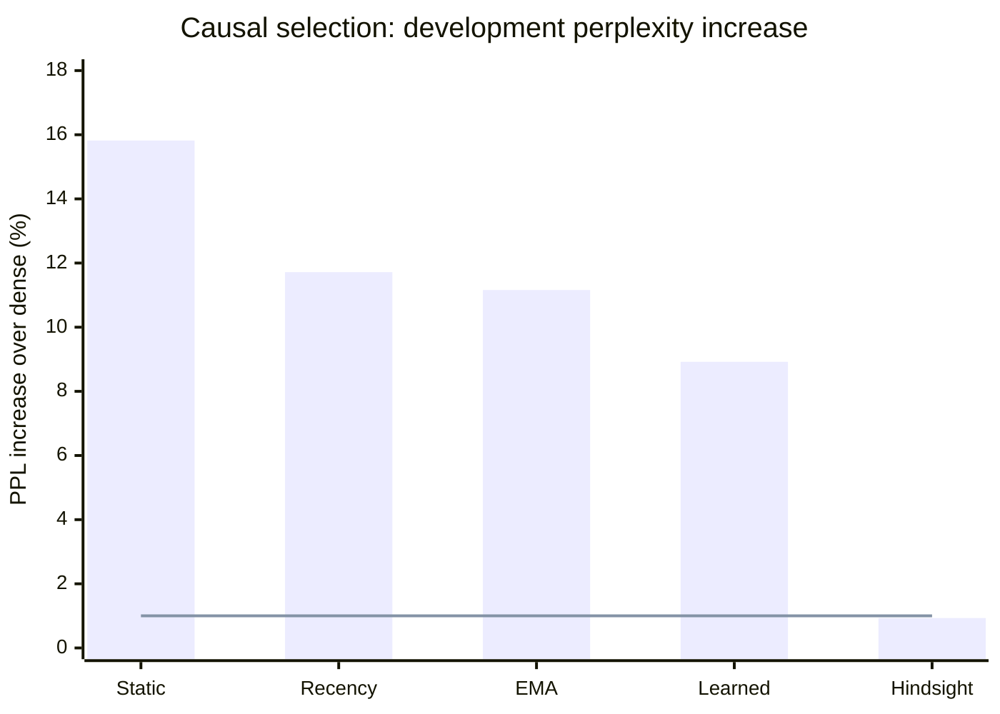
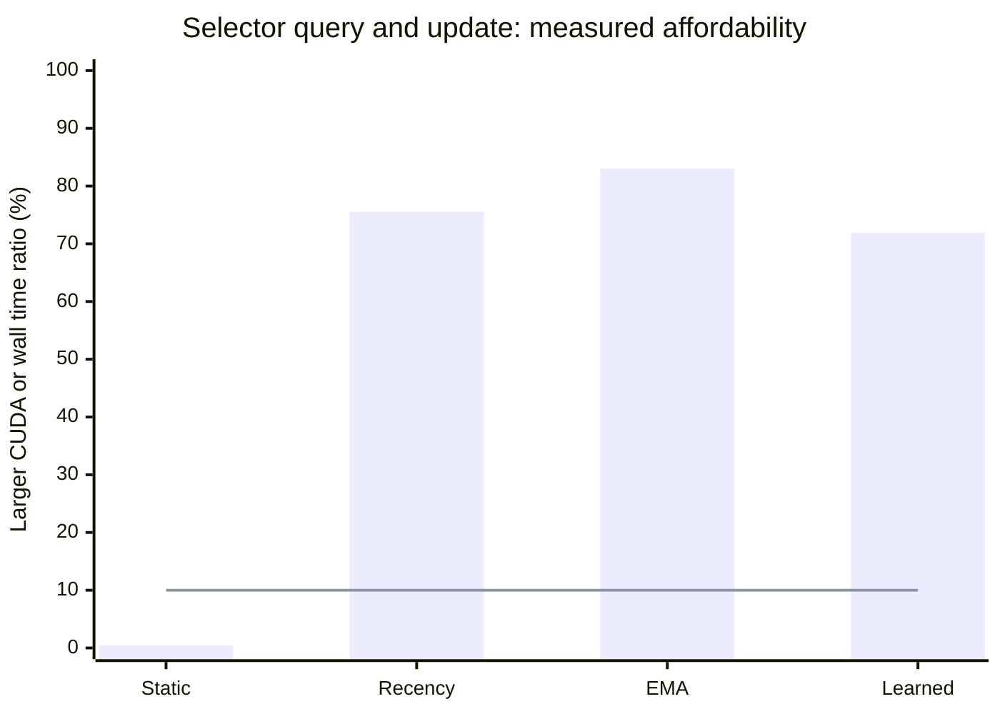

# v0.7.0 - Causal selection fails the frozen development gate

This research prerelease completes the first causal selector experiment at the
unchanged v0.4 nomination: **Qwen2.5-1.5B-Instruct, popularity packing, 8-neuron
groups, 90% retention, and a 2 GiB equal-layer static FFN cache**.
**None of the four causal selectors qualifies.** All four pass the simulated traffic
screen and fail the quality screen; recency, EMA and the learned selector also fail
the measured affordability screen. Physical paging and corrective refinement remain
gated under the prospective decision rule.

| Selector | Relative PPL | KL | Top-1 agreement | Warm byte saving | CUDA cost | Wall cost |
|---|---:|---:|---:|---:|---:|---:|
| Static popularity | 1.158203 | 0.175924 | 81.373% | 18.663% | 0.450% | 0.456% |
| Recency | 1.117159 | 0.149310 | 83.137% | 15.103% | 75.521% | 75.476% |
| EMA | 1.111589 | 0.154815 | 83.162% | 18.449% | 83.026% | 83.002% |
| Learned | 1.089204 | 0.121448 | 85.686% | 16.171% | 71.893% | 71.876% |
| Hindsight, noncausal | 1.009318 | 0.015948 | 94.289% | 15.539% | Ineligible | Ineligible |

The frozen screens are aggregate relative PPL **<=1.01**, simulated warm byte
saving **>=10%**, and **both** selector CUDA and synchronized wall median costs
**<=10%** of their paired resident dense-FFN medians. All four causal selectors
also exceed the individual 1% PPL line on **all 16 articles**. Hindsight exceeds it
on 10/16 articles despite passing the aggregate quality screen; it cannot be nominated
because its decisions require current dense activations.

The horizontal line is the frozen 1% limit. Hindsight is an ineligible control.
The learned selector has the lowest causal PPL increase, **8.92%**, but remains well
outside the screen. Faster kernels alone would not change the quality of these
recorded masks. This negative result concerns four initial implementations at one
operating point, not every possible predictor or retention setting.

Each bar is the larger of the CUDA and synchronized wall ratios, because both must
pass the 10% line. The table retains them separately. Timing uses the first 32
calibration-token fixtures across all 28 resident FFNs, three warm repetitions and
ten measured repetitions, with a separate paired dense measurement per selector.
It charges query and necessary selected-observation update. Stateless static and
learned modes avoid unused observation work. These are eager PyTorch implementations;
fused kernels and CUDA graph capture were not evaluated. The ratios are not paged
model latency, tokens per second, or end-to-end speedup.

Causal decisions precede current gate/up computation. Static selection uses the
calibration prior. Recency and EMA update from previously selected contributions.
The learned selector fits ridge regression from a fixed 64-dimensional random
projection of the current normalized FFN input and its absolute values, using only
the 80 calibration articles. Fitting uses dense document prefill; evaluation uses
each approximate path's current incremental input, with a resulting feature-distribution
change and no development refit. Independent dense omission audits never feed selector
state. Evaluation uses actual one-token KV execution on each approximate path;
the diagnostic still computes dense projections before applying masks.

Persistent selector storage is **156,800 bytes static**, **1,254,400 bytes each for
recency/EMA**, and **27,345,920 bytes learned**. Replay subtracts those tensors from
the 2 GiB FFN-cache budget and reserves an incoming group. The stronger dense baseline
receives the entire 2 GiB and can choose any parent layout and group width. Warm
simulated FFN traffic falls by 15.10-18.66%; cold rows charge static FFN preload.
Predictors are already initialized for replay, so their first-load traffic and
startup latency are excluded. Fixed weights, KV, audits and workspaces remain outside
this simulated FFN-cache budget. No RAM-to-VRAM transfers were measured.

All five modes complete the same **16 development articles**, the fixed **512-token
topic transition**, and **four 64-token greedy continuations** from 32-token prefixes.
The study reuses 20,480 calibration tokens and 4,096 development input tokens, with
4,080 scored development predictions. On the post-transition segment, relative PPL
is 1.118574 static, 1.172563 recency, 1.256669 EMA, 1.083656 learned and 1.011723
hindsight. Every generated candidate path diverges from dense. All 20 candidate and
four dense continuations, decoded text, first-divergence positions and token agreement
are retained. Agreement is not task accuracy; this is plain-text continuation on
reused Wikipedia data, not a held-out assistant benchmark.

The prospective protocol and apparatus were pushed at
[`85efbc7`](https://github.com/displague/dynamic-model-loading/commit/85efbc771b75487b7aecfe0c521c1d3e4fd5452e)
before fitting and evaluation. The pinned checkpoint is revision
`989aa7980e4cf806f80c7fef2b1adb7bc71aa306`, running FP32 under Python 3.14.3 /
torch 2.10.0+cu130 / Transformers 5.13.1 on the RTX 5080 Laptop GPU. All **28 local
and 17 incremental layout checks pass** before fitting: maximum relative L2 is
1.50012e-6 locally and 1.14874e-6 for layout logits; maximum layout KL is 4.51807e-8.
Original limits stay 0.01 L2 and 0.001 KL. Fresh dense prefill/incremental drift is
recorded separately on all 16 articles. The incremental hindsight result does not
replace v0.4's prefill-based relative PPL 1.008978 or its 9/16 individual failures.

Validation preserves **307 ordered raw rows**, **85 document mask/audit artifacts**,
**20 generated-path artifacts**, **17 dense references**, fitted tensors and sufficient
statistics. Ninety CPU tests and three reviews preceded pretrained measurement; the
last focused review rejected 42 additional corruption probes. The integrated suite
passes **111 tests in both torch environments**. The independent analyzer verifies
source/checkpoint/input hashes, numerical gates, dense-derived NLL, complete grids,
charged cache replay, timing medians, generated receipts and every aggregate.
Restoration of all **124 payloads** from three hashed ZIP assets reproduces the
validated summary exactly. Release validation runs the full suite again from the
clean committed candidate.

The diagnostic retains 6,174,857,216 bytes of model parameters and another
4,624,220,160 bytes of FFN restoration copies. These payload counts are not allocator
peaks or bounded residency. Successful completion is recorded only after restoration.

This closes the bounded experiment in
[issue #15](https://github.com/displague/dynamic-model-loading/issues/15).
[Broader predictor feasibility #10](https://github.com/displague/dynamic-model-loading/issues/10),
[held-out quality #8](https://github.com/displague/dynamic-model-loading/issues/8),
[paging #11](https://github.com/displague/dynamic-model-loading/issues/11) and
[refinement #12](https://github.com/displague/dynamic-model-loading/issues/12) remain
open. No final-test score, retuned retention, or relaxed threshold follows from this
failure. Any further predictor or scale control requires a separate prospective
experiment; the original plan is not declared complete.

Evidence and reproduction:
[protocol](https://github.com/displague/dynamic-model-loading/blob/v0.7.0/docs/causal-control-protocol.md),
[complete findings](https://github.com/displague/dynamic-model-loading/blob/v0.7.0/docs/causal-control-results.md),
[archive, hashes and restoration](https://github.com/displague/dynamic-model-loading/tree/v0.7.0/results/causal-control-20260911),
[standalone quality/traffic/cost figure](https://github.com/displague/dynamic-model-loading/blob/v0.7.0/results/causal-control-20260911/figures/causal-frontier.svg),
[research plan](https://github.com/displague/dynamic-model-loading/blob/v0.7.0/docs/plan.md).
