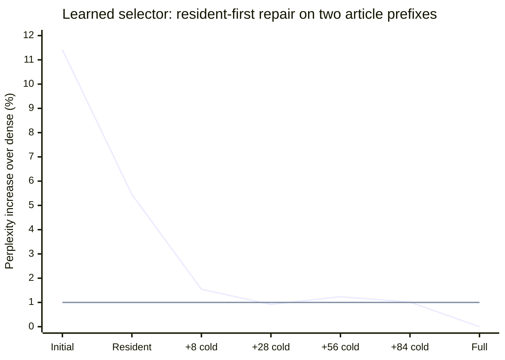

# v0.8.0 - Failed selections can be repaired in a narrow privileged diagnostic

Five of 48 fixed-mask repair settings pass the predeclared **aggregate relative
PPL <=1.01 and simulated warm transfer saving >=10%** screen. None of 20 fresh
larger one-shot settings passes both. Recency plus 28 hindsight-selected additions
also passes the quality line on both articles; the other four aggregate-passing
settings pass on one article each. **No causal policy or runtime is nominated.**

This is the first test of correction after an inadequate initial selection. It uses
the first two v0.7 development articles, truncated prospectively to 128 input tokens
each: 256 input visits and 254 predicted tokens. It is a small reused development
sample, not held-out confirmation or a replacement for v0.7's 16-article failure.
The original protocols, thresholds and results remain unchanged.

| Initial selector / repair schedule | Additions per layer visit (resident + cold) | Final FFN fraction | Relative PPL | Warm saving | Article passes |
|---|---:|---:|---:|---:|---:|
| recency-hindsight-28 | 9.213 + 18.787 | 92.500% | 1.005318 | 11.774% | 2/2 |
| recency-resident_first-8 | 22.042 + 8.000 | 92.682% | 1.008490 | 13.572% | 1/2 |
| ema-hindsight-28 | 0.436 + 27.564 | 92.500% | 1.009740 | 13.792% | 1/2 |
| ema-resident_first-28 | 1.157 + 28.000 | 92.603% | 1.009784 | 13.719% | 1/2 |
| learned-resident_first-28 | 10.136 + 27.951 | 93.401% | 1.009158 | 11.177% | 1/2 |

All repairs start with 1,008 of 1,120 width-8 groups in each of 28 Qwen2.5-1.5B-Instruct
FFNs. The hindsight schedule adds up to its limit from the omitted groups. The
resident-first schedule first includes every omitted resident group, then adds up
to its limit in cold groups. Additions are averaged over all layer visits. Resident
work avoids new transfer in this cache simulation but still adds computation.

The initial masks are frozen from the original causal trajectories. After correction
changes an input, those old masks are counterfactual choices. Repair ranking also
uses current dense activations. These are privileged, heuristic diagnostics; even
the resident-only variants are not causal corrected-policy rollouts or optimal oracles.

## What residency changes

For the learned selector on this sample, the uncorrected relative PPL is 1.114143.
Adding only omitted resident groups reduces it to **1.054495**, with no added cold
traffic relative to the equally charged initial replay. Adding a further average
27.951 cold groups per layer visit reaches **1.009158**, using 93.401% of FFN group
volume and retaining **11.177%** simulated warm saving. The additional cold volume is
**0.107479 GiB per input token**. Its second article still has relative PPL 1.023071.

Recency's resident-first eight-cold-group setting restores an average 22.042 resident
groups plus eight cold groups per layer visit: only **0.030762 GiB** of additional
cold traffic per input token. Aggregate relative PPL is 1.008490, but article values
0.989118 and 1.028240 show the cancellation hidden by the aggregate.

The second line is the 1% diagnostic line. More corrective work does not produce a
monotonic perplexity curve: each condition creates its own downstream trajectory,
and contribution-norm ranking does not optimize NLL. The complete report includes
all 68 conditions and both article scores rather than only the passing settings.

## Evidence, accounting and validation

The prospective protocol and apparatus were committed and pushed as
[f2d0cf6](https://github.com/displague/dynamic-model-loading/commit/f2d0cf6) before measurement. The original FP32 CUDA environment
was used; all **56** controls pass: native-reference reproduction, every local grouped
FFN reconstruction, full layout reconstruction, exact original-selector masks,
zero-repair reproduction and full-repair reconstruction. The run preserves **260
ledger rows, 144 applied-mask/audit traces and 10 reference-logit payloads**.

Repairs preserve the FFN input and add a separate down-projection contribution before
downstream commitment. Dense gate/up tensors, audit computation, the full model and
restoration copies remain in the apparatus. Skipped weights are only analytical.
Original selector storage plus **1,034,880 repair-metadata bytes** reduce the 2 GiB
FFN-cache capacity, with an incoming group reserved. The comparison is the strongest
full-budget dense static layout; its warm traffic is **2.306854 GiB per input token**.
Small negative savings at full restoration reflect charged metadata. Selector startup,
real loading, repair latency, bounded model residency and end-to-end speed are unmeasured.

Independent analysis validates source Git blobs, frozen inputs, reference NLL,
selector reproduction, every repair union and ranking receipt, charged cache replay,
the full grid and all aggregates. Both release ZIPs are checked payload by payload;
a clean restoration must reproduce the analysis. The complete CPU fixture suite has
147 tests in each available PyTorch environment; final clean-tip validation is retained
in the publication receipt. No pretrained scoring is repeated for publication.

## Resulting dependency

The accepted [gate ADR](https://github.com/displague/dynamic-model-loading/blob/v0.8.0/docs/adr/0001-selection-and-refinement-gates.md)
allows analytical correction from a failed first pass. The **complete causal
selection-and-refinement policy** must qualify before physical paging or refinement
runtime. This delivery closes bounded [#17](https://github.com/displague/dynamic-model-loading/issues/17), while analytical
feasibility [#12](https://github.com/displague/dynamic-model-loading/issues/12), causal acquisition [#19](https://github.com/displague/dynamic-model-loading/issues/19), runtime
[#16](https://github.com/displague/dynamic-model-loading/issues/16), paging [#11](https://github.com/displague/dynamic-model-loading/issues/11) and held-out quality remain open.

The next causal test should combine current input, observed execution history and
residency, charging any probes and abstention/fallback. These curves identify an
opportunity worth predicting; they do not establish that an affordable causal signal
exists. Separate hardware-cost and balanced two-model controls proceed under their
own prospective protocols.

[Complete findings and all curves](https://github.com/displague/dynamic-model-loading/blob/v0.8.0/docs/refinement-feasibility-results.md),
[prospective protocol](https://github.com/displague/dynamic-model-loading/blob/v0.8.0/docs/refinement-feasibility-protocol.md),
[immutable archive and restoration instructions](https://github.com/displague/dynamic-model-loading/tree/v0.8.0/results/repair-control-20260911).
